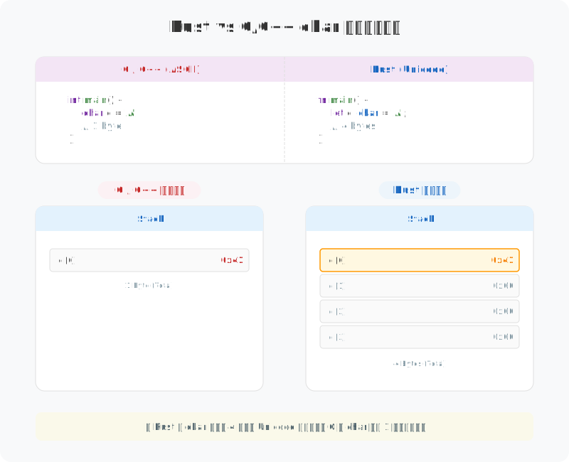
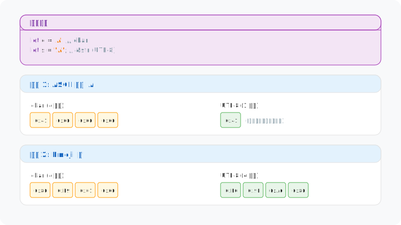
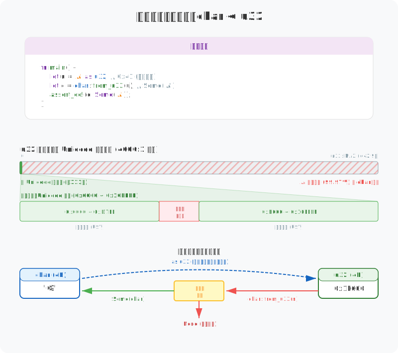

# 图解 Rust 字符串与文本：字符（char）

> 在 Rust 里，`char` 不只是字节的别名。它是一个固定的 4 字节容器，专门用来装 Unicode 标量值。搞清楚它的内存布局和逻辑规则，是处理好国际化文本的基础。

## 1. 内存布局：固定的 4 字节容器

在 C/C++ 这种语言里，`char` 就是个 1 字节的整数，基本只能存 ASCII。但在 Rust 中，`char` 统一占 **4 个字节 (32 bits)**。

虽然存简单的字母时有点占地儿，但这么做有两个大好处：
- **通吃全球字符**：4 字节足够装下任何 Unicode 字符，不管是简单的字母还是复杂的 Emoji。
- **随机访问飞快**：因为每个字符宽度都一样，处理 `Vec<char>` 时直接按索引跳就行了，不像 UTF-8 那样得从头遍历。

## 2. 紧凑存储 vs 逻辑计算：String 与 Char 的角色差异

其实 `String` 和 `char` 的分工很明确：`String` 用 UTF-8 编码把数据压得很紧，主要是为了省地方（适合存盘、传网），代价是没法直接用下标找字符。而 `char` 是解码后的状态，固定 4 字节的宽度让它在内存里排得整整齐齐，处理起来（比如遍历或修改）效率最高。一句话：`String` 负责存，`char` 负责算。

## 3. 类型转换 (char ↔ u32)

Rust 在类型转换上非常严格，以确保 `char` 始终包含有效的 Unicode 标量值。

- **`char as u32`**：**零开销**，始终安全。这是直接的内存拷贝，将 4 字节的 `char` 解释为整数。
- **`char::from_u32(val)`**：**有校验开销**，返回 `Option<char>`。因为必须检查数值是否在合法 Unicode 区域（非代理区、且不超过 `0x10FFFF`）。

## 4. 总结

在 Rust 中，`char` 扮演着文本处理“解码器”的角色。它通过 4 字节的固定宽度，解决了 UTF-8 无法直接随机访问的问题。Rust 的设计逻辑很简单：在磁盘存储和网络传输时使用紧凑的 UTF-8，而在内存中进行逻辑运算或字符处理时，则利用 `char` 的等宽特性来提升性能。这种设计配合严格的类型检查，在保证处理全球字符准确性的同时，也兼顾了执行效率。

---

**创作声明**：本文以“图解”为核心，所有技术图表均由作者原创设计。文章利用 AI 工具辅助进行文字润色与纠错，以确保技术表述的严谨性与准确性。
