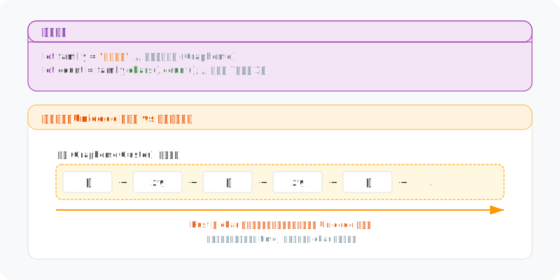

# 图解 Rust 字符串与文本：字符（char）

> 在 Rust 中，`char` 并不是简单的字节别名，而是一个严谨的、固定 4 字节大小的 Unicode 标量值容器。理解它的物理边界与逻辑约束，是掌握 Rust 国际化文本处理的关键。

## 1. 物理本质：坚固的 4 字节容器

在 C/C++ 等语言中，`char` 本质上是一个 **8 位整数 (1 字节)**，通常只能表示 ASCII 字符。但在 Rust 中，`char` 发生了质变：它始终占据 **4 个字节 (32 bits)**。


这种设计虽然在存储 ASCII 时显得“浪费”，但它带来了两个核心优势：
- **全球化支持**：4 字节足以容纳任何一个 Unicode 标量值（从简单的 'A' 到复杂的 Emoji '🦀'）。
- **O(1) 访问特性**：由于每个字符步长固定，在处理 `Vec<char>` 时，编译器可以通过 `index * 4` 瞬间定位到任何一个字符，而无需像 UTF-8 字符串那样从头遍历。

- **内存布局**：在内存中，Rust `char` 按照 4 字节边界对齐，确保 CPU 读取效率。

## 2. 逻辑约束：合法的标量范围

`char` 类型不仅仅是 `u32` 的包装。Rust 强制执行 Unicode 安全不变性（Invariants）：

- **有效区间**：仅允许 `0x0000` 到 `0xD7FF` 以及 `0xE000` 到 `0x10FFFF`。
- **排除代理对 (Surrogates)**：`0xD800` 到 `0xDFFF` 的区间被严格禁止，因为它们在 UTF-16 中用于组成代理对，本身不代表独立的字符。
- **类型安全**：从 `u32` 转换为 `char` 必须经过校验，这保证了任何一个 `char` 变量在逻辑上都是合法的 Unicode 字符。

## 3. Char vs UTF-8：存储与传输的博弈

新手常问：既然 `String` 底部是 UTF-8 编码，为什么不直接存 `char`？这涉及到**存储密度**与**处理速度**的权衡。


- **UTF-8 (String)**：是一种**变长编码**。它对 ASCII 极其友好（仅 1 字节），适合磁盘存储和网络传输，但牺牲了随机访问性能。
- **Char**：是一种**解码后的状态**。它适合在内存中进行密集的算法处理、字符过滤或模式匹配。

## 4. 类型转换与安全性

由于 `char` 的物理布局与 `u32` 相同，但逻辑约束不同，因此它们之间的转换遵循不同的安全策略。


```rust
// ✅ 安全转换：char 总是可以安全转为 u32
let c = '🦀';
let u = c as u32; // 0x1F980

// ❌ 风险转换：u32 转 char 可能失败
let val = 0x110000;
let c_opt = std::char::from_u32(val); // None，因为超出了 Unicode 范围
```

- **显式转换 (`as`)**：从 `char` 到 `u32` 是零开销的，直接由编译器解释。
- **校验转换 (`from_u32`)**：从 `u32` 到 `char` 需要运行时范围检查，这是 Rust 保证内存安全的体现。

## 5. 深度警示：Char 不等于“用户看到的字符”

这是 Unicode 处理中最深的坑：一个 `char` 仅代表一个 **Unicode 标量值 (Scalar Value)**，而用户感知的一个“字符”（如带声调的字母或组合 Emoji）通常是一个 **字形簇 (Grapheme Cluster)**。



如上图所示，一个“一家四口”的 Emoji 👨‍👩‍👧‍👦 实际上是由 7 个 `char` 组成的。在 Rust 中，`"👨‍👩‍👧‍👦".chars().count()` 会返回 `7`。如果你需要处理用户感知的字符，应该使用第三方库如 `unicode-segmentation`。

## 6. 设计哲学

Rust 对 `char` 的设计体现了其对**正确性**与**性能**的平衡：

- **物理上**：通过固定 4 字节确保内存操作的可预测性与 CPU 友好性。
- **逻辑上**：通过严格的范围校验，将编码错误拦截在编译期或转换期，防止非法 Unicode 进入系统底层。
- **操作上**：明确区分“字节流 (`u8`)”、“标量值 (`char`)”与“字形簇”，迫使开发者正视国际化文本的复杂性。

---

**创作声明**：本文以“图解”为核心，所有技术图表均由作者原创设计。文章利用 AI 工具辅助进行文字润色与纠错，以确保技术表述的严谨性与准确性。
