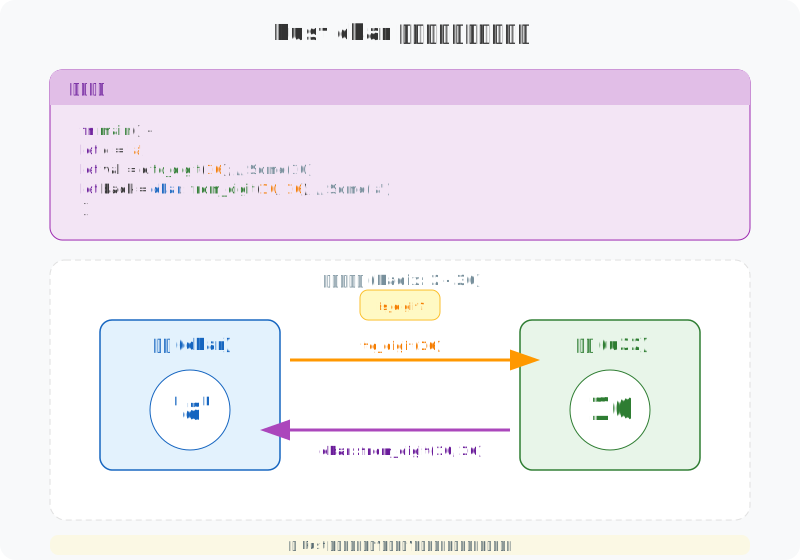

# 图解 Rust 字符串与文本：字符（char）

> 在 Rust 中，`char` 并不是简单的字节别名，而是一个严谨的、固定 4 字节大小的 Unicode 标量值容器。理解它的物理边界与逻辑约束，是掌握 Rust 国际化文本处理的关键。

## 1. 物理本质：坚固的 4 字节容器

在 C/C++ 等语言中，`char` 本质上是一个 **8 位整数 (1 字节)**，通常只能表示 ASCII 字符。但在 Rust 中，`char` 发生了质变：它始终占据 **4 个字节 (32 bits)**。

## 2. 编码二象性：存储 vs 处理

理解 `String` (UTF-8) 与 `char` (Unicode Scalar) 的区别，是高性能文本处理的前提。

> **思考**：为什么 `String` 不直接由 `char` 组成？
> `String` 是一个集合。如果它由 `char` 组成（即 `Vec<char>`），虽然支持 O(1) 索引，但会浪费大量内存（每个 ASCII 字符都要占 4 字节）。Rust 选择了 `String` (UTF-8) 以节省空间，但在需要随机访问时，我们往往需要将其转换为 `Vec<char>`。

| 特性 | String / &str (UTF-8) | char (Unicode Scalar) |
| :--- | :--- | :--- |
| **本质** | 变长字节序列 (`Vec<u8>`) | 定长数值 (`u32` subset) |
| **存储效率** | 高 (ASCII 仅 1 字节) | 低 (固定 4 字节) |
| **索引访问** | O(N) - 无法直接索引 | O(1) - 可直接跳转 (如果是 `Vec<char>`) |
| **适用场景** | 存储、传输、IO | 逐字分析、状态机解析、正则匹配 |

## 3. 转换的艺术：类型安全与进制操作

Rust 提供了严格的类型转换机制，杜绝了 C/C++ 中常见的溢出与截断问题。

### 3.1 安全转换 (`u32` <-> `char`)
- **`char as u32`**：**零开销**，始终安全。
- **`char::from_u32`**：**有开销**，返回 `Option<char>`。必须检查是否落入非法区域（代理区或超过最大值）。

### 3.2 进制转换 (`Digit`)
处理十六进制字符串或自定义进制时，`char` 提供了便捷的方法：

- **`to_digit(radix)`**：将字符转为数字。`'a'.to_digit(16)` ➡ `Some(10)`。
- **`from_digit(num, radix)`**：将数字转为字符。`char::from_digit(10, 16)` ➡ `Some('a')`。

## 4. 视觉欺骗：Char ≠ 字形 (Grapheme)

这是初学者最容易踩的坑：**一个 `char` 并不一定对应屏幕上的一个“字”**。

- **变音符组合**：`e` + `́` = `é`。这是 **2 个 char**，但在视觉上是 **1 个字**。
- **Emoji 连字**：`👨‍👩‍👧‍👦` 由 4 个 Emoji 和 3 个零宽连接符 (ZWJ) 组成，共 **7 个 char** 序列！

> **警告**：永远不要假设 `string.len()` 是字符数，也不要假设 `string.chars().count()` 是用户看到的字数。处理“人类可读”文本长度时，请使用 `unicode-segmentation` crate。

## 5. 总结

Rust 的 `char` 设计打破了传统的“字节即字符”的观念：

1.  **类型安全**：将字符编码的复杂性封装在类型系统中，强制处理无效输入。
2.  **内存确定性**：固定 4 字节使得内存布局可预测，虽然牺牲了部分空间，但换取了处理逻辑的统一。
3.  **语义精确**：明确区分“字节 (Byte)”、“标量 (Scalar)”和“字形 (Grapheme)”，迫使开发者编写正确的国际化代码。

---

**创作声明**：本文以“图解”为核心，所有技术图表均由作者原创设计。文章利用 AI 工具辅助进行文字润色与纠错，以确保技术表述的严谨性与准确性。
