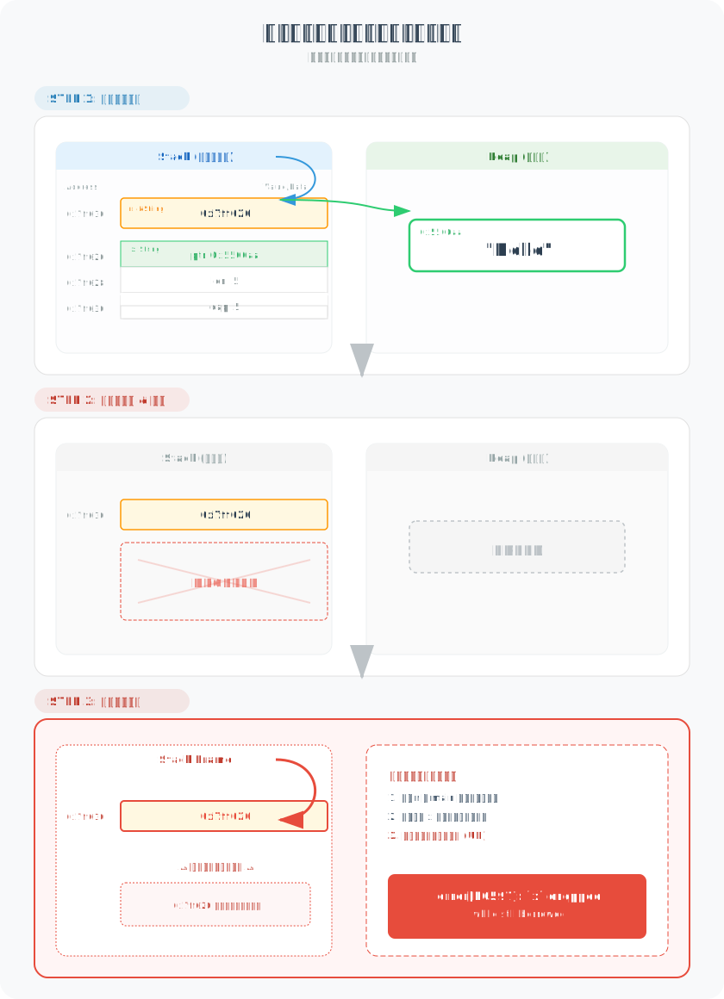
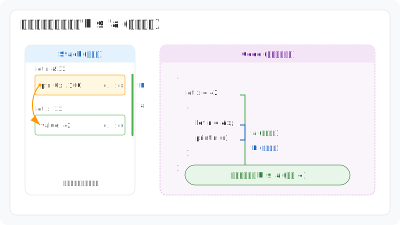
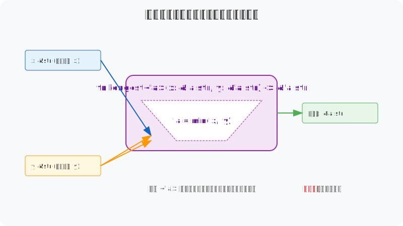
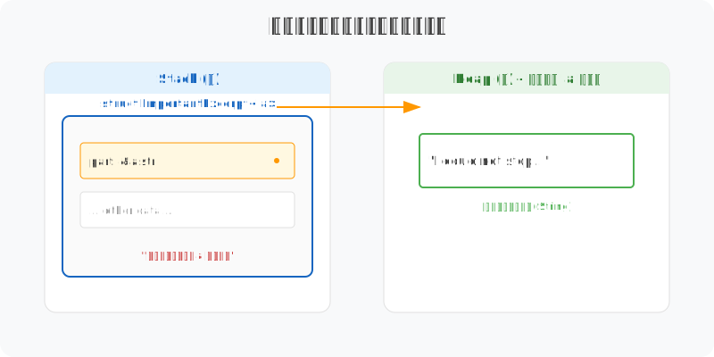

# 图解 Rust 生命周期：引用的有效性证明与约束机制

> **生命周期（Lifetime）** 是 Rust 借用检查器的底层基石。它描述的是引用与其背后的数据在内存中客观存在的**作用域包含关系**。Rust 引入这一机制并非为了增加认知负荷，而是为了在编译阶段通过建立“引用的寿命不得超过数据寿命”这一物理约束，从源头上彻底杜绝 C/C++ 中很容易发生的**悬垂指针（Dangling Pointer）**问题。

---

## 1. 悬垂引用：引用的“死后”访问

生命周期的核心任务只有一个：**确保所有引用永远有效**。

如果不加拦截，程序可能会尝试访问已经释放的内存（即“死掉”的数据）。借用检查器（Borrow Checker）的任务就是在编译时识别出这种风险。



- **物理事实**：在上面的示例中，变量 `x` 在内部作用域结束时被弹出栈（Drop）。
- **逻辑矛盾**：外部作用域的 `r` 依然保存着 `x` 的地址。如果此时通过 `r` 访问内存，就会导致未定义行为（UB）。
- **Rust 的方案**：借用检查器会对比 `r` 和 `x` 的作用域，发现 `x` 走得太早，于是直接拒绝编译。

---

## 2. 借用检查器：生命周期的“金律”

很多人误以为 `'a` 这种标注能改变变量的寿命。事实上，生命周期标注是**描述性**的，而非**指令性**的。它只是在描述一段已经存在的客观事实。

编译器通过比较变量的 **作用域范围** 来判断引用是否合法。



- **'a (数据)**：被引用数据的实际有效区间。
- **'b (引用)**：引用变量本身的存活区间。
- **金律**：引用的生命周期必须是数据生命周期的**子集**（即 `'b ⊆ 'a`）。

> **Deep Insight**: 生命周期标注 `'a` 本质上是一个**约束（Constraint）**。当你写下 `&'a i32` 时，你是在告诉编译器：“这个引用的有效期绝对不会超过它的源头数据。”

---

## 3. 函数签名：生命周期的“漏斗”模型

当函数涉及多个引用且返回一个引用时，编译器面临一个难题：返回值的寿命到底该挂钩到哪个输入？

### **编译器的“选择困难症”**

考虑经典的 `longest` 函数：

```rust
fn longest<'a>(x: &'a str, y: &'a str) -> &'a str {
    if x.len() > y.len() { x } else { y }
}
```

在编译阶段，编译器并不知道运行时到底会返回 `x` 还是 `y`。为了保证安全，它必须假设**最坏的情况**。

### **漏斗模型演示**

我们可以通过“漏斗模型”来直观理解这种流转：



1. **输入阶段**：函数接收 `x` 和 `y`。它们各自有不同的寿命长度（'x 和 'y）。
2. **约束收敛（'a）**：泛型标签 `'a` 就像一个漏斗。当你把 `x` 和 `y` 都标记为 `'a` 时，漏斗会自动收缩到**最窄的那一个输入**的宽度。
3. **流转结果**：返回值的标签也是 `'a`。这意味着，返回值的“有效身份证”上被强制盖了一个戳：它的有效期等于 `min('x, 'y)`。

**总结**：生命周期标注不是在搬运数据，而是在**传递有效性证据**。它确保了返回的引用永远不会比任何一个潜在源头活得更久。

---

## 4. 结构体绑定：引用的“传染性”

当结构体持有引用时，它必须显式标注生命周期。这是一种**强绑定声明**。



```rust
struct ImportantExcerpt<'a> {
    part: &'a str,
}
```

- **意义**：这行代码告诉编译器：`ImportantExcerpt` 实例的寿命不能超过它内部 `part` 引用的那个字符串。
- **连锁反应**：这种约束具有“传染性”。任何持有该结构体的代码，都必须遵守这个生命周期约束。

---

## 5. 总结

生命周期是 Rust **零成本抽象**（Zero-cost Abstractions）的典范。它在编译期完成了所有的安全检查，而在运行期，这些 `'a` 标注会全部消失，不产生任何性能开销。

**核心逻辑回顾：**
- **本质**：生命周期是引用的有效性证明。
- **规则**：引用寿命 ⊆ 数据寿命。
- **流转**：函数标注确保了返回引用的源头可追溯。

> **Deep Insight**: 学习生命周期时，不要试图“控制”内存，而要学会如何向编译器“证明”你的内存访问是安全的。一旦你掌握了这种“证明”逻辑，Rust 的借用检查器就不再是你的敌人，而是你最忠实的守卫。

---

> **创作声明**：本文技术观点及视觉图表设计由作者原创。文章利用 AI 工具辅助进行文字润色与纠错，以确保技术表述的严谨性与准确性。
