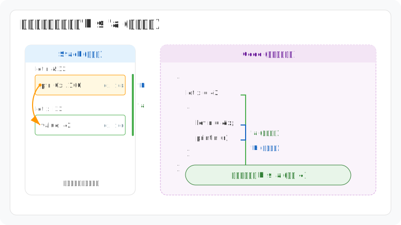
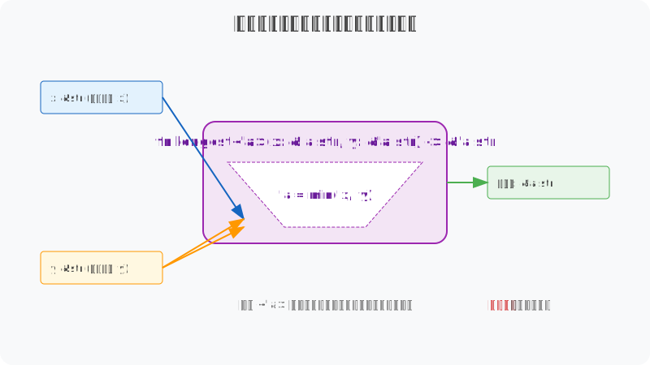
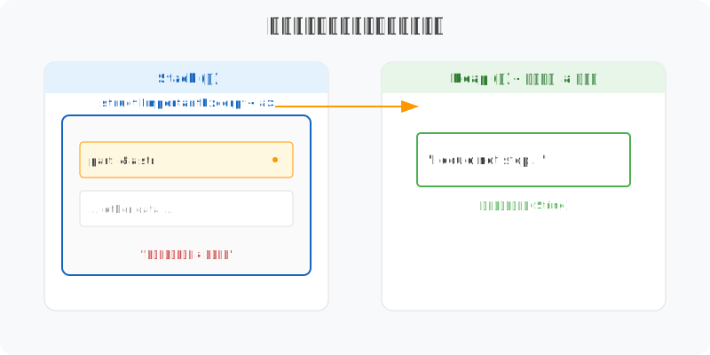

# 图解 Rust 生命周期：引用能活多久的检查

**生命周期 (Lifetime)** 的机制其实很直白：编译器在编译时，会根据代码的**控制流**计算出引用的**有效范围**。**借用检查器 (Borrow Checker)** 的工作就是确保**引用不会比它指向的数据活得更久**。这种静态检查直接在编译期排除了 C/C++ 中常见的**悬垂指针 (Dangling Pointer)** 隐患，所以代码在运行时既安全，又没有额外的性能开销。

---

## 1. 悬垂引用：引用不能活得比数据久

在 C/C++ 中，最容易写出的 Bug 之一就是**悬垂指针 (Dangling Pointer)**：指针还握在手里，但它指向的那块内存可能早就被释放了，甚至被其他数据覆盖了。这就像是你手里拿着一把钥匙，但房子已经被拆了。这时候再去开门，后果是未知的。

Rust 的生命周期机制，就是为了**彻底杜绝**这种情况。我们来看一段简单的代码，这段代码在 Rust 里是编译不过的：

```rust
fn main() {
    let r;                // ---------+-- 'a
    {                     //          |
        let x = 5;        // -+-- 'b  |
        r = &x;           //  |       |
    }                     // -+       |
                          //          |
    println!("r: {}", r); //          |
}                         // ---------+
```


**问题核心：悬垂引用**

如上图所示，当内部花括号结束时，数据 `x` 被销毁（生命周期 `'b` 结束），但外部引用 `r` 依然存在（生命周期 `'a`）。

**借用检查器** 发现引用活得比数据久（`'a` > `'b`），违反了“引用必须包含在数据生命周期内”的规则，因此拒绝编译。

```bash
error[E0597]: `x` does not live long enough
  --> src/main.rs:6:13
   |
6  |         r = &x;
   |             ^^ borrowed value does not live long enough
7  |     }
   |     - `x` dropped here while still borrowed
```

---

## 2. 借用检查器：标注并不会改变生命周期

很多人误以为 `'a` 这种标注能改变变量的寿命。事实上，生命周期标注是**描述性**的，而非**指令性**的。它只是在描述一段已经存在的客观事实。

编译器通过比较变量的 **作用域范围** 来判断引用是否合法。



- **'a (数据)**：被引用数据的实际有效区间。
- **'b (引用)**：引用变量本身的存活区间。
- **金律**：引用的生命周期必须是数据生命周期的**子集**（即 `'b ⊆ 'a`）。

> **Deep Insight**: 生命周期标注 `'a` 本质上是一个**约束（Constraint）**。当你写下 `&'a i32` 时，你是在告诉编译器：“这个引用的有效期绝对不会超过它的源头数据。”

---

## 3. 函数签名：生命周期的“漏斗”模型

当函数涉及多个引用且返回一个引用时，编译器面临一个难题：返回值的寿命到底该挂钩到哪个输入？

#### **编译器的“选择困难症”**

考虑经典的 `longest` 函数：

```rust
fn longest<'a>(x: &'a str, y: &'a str) -> &'a str {
    if x.len() > y.len() { x } else { y }
}
```

在编译阶段，编译器并不知道运行时到底会返回 `x` 还是 `y`。为了保证安全，它必须假设**最坏的情况**。

#### **漏斗模型演示**

我们可以通过“漏斗模型”来直观理解这种流转：



1. **输入阶段**：函数接收 `x` 和 `y`。它们各自有不同的寿命长度（'x 和 'y）。
2. **约束收敛（'a）**：泛型标签 `'a` 就像一个漏斗。当你把 `x` 和 `y` 都标记为 `'a` 时，漏斗会自动收缩到**最窄的那一个输入**的宽度。
3. **流转结果**：返回值的标签也是 `'a`。这意味着，返回值的“有效身份证”上被强制盖了一个戳：它的有效期等于 `min('x, 'y)`。

**总结**：生命周期标注不是在搬运数据，而是在**传递有效性证据**。它确保了返回的引用永远不会比任何一个潜在源头活得更久。

---

## 4. 结构体绑定：引用的“传染性”

当结构体持有引用时，它必须显式标注生命周期。这是一种**强绑定声明**。



```rust
struct ImportantExcerpt<'a> {
    part: &'a str,
}
```

- **意义**：这行代码告诉编译器：`ImportantExcerpt` 实例的寿命不能超过它内部 `part` 引用的那个字符串。
- **连锁反应**：这种约束具有“传染性”。任何持有该结构体的代码，都必须遵守这个生命周期约束。

---

## 5. 总结

生命周期是 Rust **零成本抽象**（Zero-cost Abstractions）的典范。它在编译期完成了所有的安全检查，而在运行期，这些 `'a` 标注会全部消失，不产生任何性能开销。

**核心逻辑回顾：**
- **本质**：生命周期是引用的有效性证明。
- **规则**：引用寿命 ⊆ 数据寿命。
- **流转**：函数标注确保了返回引用的源头可追溯。

> **Deep Insight**: 学习生命周期时，不要试图“控制”内存，而要学会如何向编译器“证明”你的内存访问是安全的。一旦你掌握了这种“证明”逻辑，Rust 的借用检查器就不再是你的敌人，而是你最忠实的守卫。

---

> **创作声明**：本文技术观点及视觉图表设计由作者原创。文章利用 AI 工具辅助进行文字润色与纠错，以确保技术表述的严谨性与准确性。
