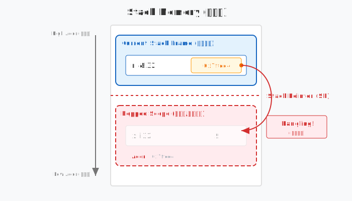
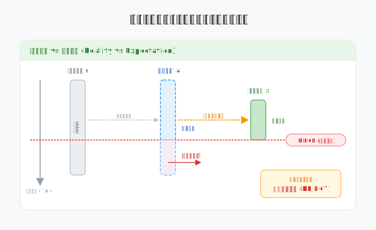
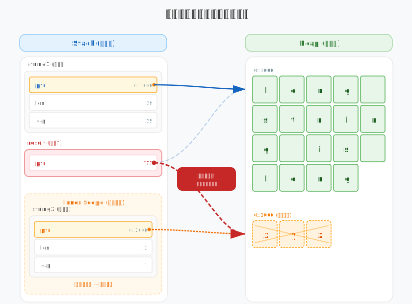
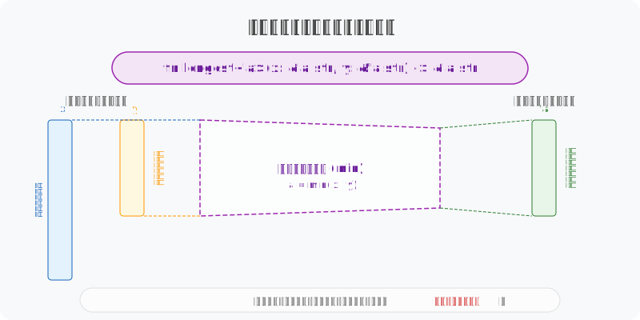
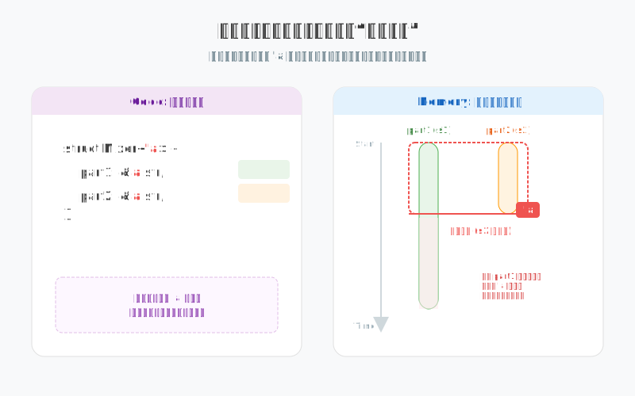

# 图解 Rust 生命周期：为编译器消除歧义

**生命周期 (Lifetime)** 的机制其实很直白：编译器在编译时，会根据代码的**控制流**计算出引用的**有效范围**。**借用检查器 (Borrow Checker)** 的工作就是确保**引用不会比它指向的数据活得更久**。这种静态检查直接在编译期排除了 C/C++ 中常见的**悬垂指针 (Dangling Pointer)** 隐患，所以代码在运行时既安全，又没有额外的性能开销。

---

## 1. 悬垂引用：引用不能活得比数据久

在 C/C++ 中，最容易写出的 Bug 之一就是**悬垂指针 (Dangling Pointer)**：指针还握在手里，但它指向的那块内存可能早就被释放了，甚至被其他数据覆盖了。这就像是你手里拿着一把钥匙，但房子已经被拆了。这时候再去开门，后果是未知的。

Rust 的生命周期机制，就是为了**彻底杜绝**这种情况。我们来看一段简单的代码，这段代码在 Rust 里是编译不过的：

```rust
fn main() {
    let r;                // ---------+-- 'a
    {                     //          |
        let x = 5;        // -+-- 'b  |
        r = &x;           //  |       |
    }                     // -+       |
                          //          |
    println!("r: {}", r); //          |
}                         // ---------+
```



如上图所示，当内部花括号结束时，数据 `x` 被销毁（生命周期 `'b` 结束），但外部引用 `r` 依然存在（生命周期 `'a`）。

**借用检查器** 发现引用活得比数据久（`'a` > `'b`），违反了“引用必须包含在数据生命周期内”的规则，因此拒绝编译。

```bash
error[E0597]: `x` does not live long enough
  --> src/main.rs:6:13
   |
6  |         r = &x;
   |             ^^ borrowed value does not live long enough
7  |     }
   |     - `x` dropped here while still borrowed
```

---

## 2. 借用检查器：标注并不会改变生命周期

很多人误以为 `'a` 这种标注能改变变量的寿命。事实上，生命周期标注是**描述性**的，而非**指令性**的。它只是在描述一段已经存在的客观事实。

编译器通过比较变量的 **作用域范围** 来判断引用是否合法。

```rust
// 标注 'a：只是检查规则，不能延长寿命
fn pass<'a>(x: &'a i32) -> &'a i32 {
    x
}

fn main() {
    let r;
    {
        let x = 42;
        // ❌ 借用检查拒绝：x 即将销毁，不能被外面的 r 引用
        r = pass(&x);
    }
    println!("{}", r);
}
```



**标注无法“续命”**

给引用标上 `'a`，**并不能让数据多活哪怕一微秒**。编译器决定数据何时销毁，只看代码块（Scope）的物理结束点，完全无视你的标注。

如上图所示，你试图宣称引用拥有 `'a` 的时长，但底层数据在 `'b` 结束时就已经被清理。这直接违反了 **'a ⊆ 'b**（引用寿命 ≤ 数据寿命）的内存安全铁律，编译器必然会拦截。

---

## 3. 既然无法“续命”，为何还要标注？

如果标注不能延长变量的寿命，那为什么 Rust 还要强迫我们在函数签名里写上 `'a` 呢？

答案在于**编译器对函数边界的“盲区”**。Rust 编译器（借用检查器）在分析一个函数时，**只看函数的签名，而不看函数的内部实现**。这种“本地化分析”确保了编译速度，但也带来了一个严重的歧义问题：当函数返回一个引用时，它到底是指向哪个输入参数？

考虑经典的 `longest` 函数，如果我们试图在不写生命周期标注的情况下编译它：

```rust
fn main() {
    let string1 = String::from("long string is long");
    let result;
    {
        let string2 = String::from("xyz");
        //  编译器无法确定 result 引用的是 string1 还是 string2
        result = longest(string1.as_str(), string2.as_str());
    } // string2 离开作用域，内存释放

    //  如果 result 指向 string2，这里就是悬垂指针
    println!("The longest string is {}", result);
}

//  编译报错：missing lifetime specifier
// 编译器无法推断返回值的生命周期来自 x 还是 y
fn longest(x: &str, y: &str) -> &str {
    if x.len() > y.len() { x } else { y }
}
```




编译器无法确定返回值究竟借用自哪个参数（`x` 还是 `y`)。为了避免潜在的悬垂引用，它必须拒绝编译，并要求我们显式标注生命周期契约。


当我们加上 `'a` 时，情况就完全不同了：

```rust
fn main() {
    let string1 = String::from("long string is long");
    let result;
    {
        let string2 = String::from("xyz");
        result = longest(string1.as_str(), string2.as_str());
        println!("The longest string is {}", result); // ✅ 正常运行
    }
}

fn longest<'a>(x: &'a str, y: &'a str) -> &'a str {
    if x.len() > y.len() { x } else { y }
}
```



显式标注 `'a` **根本没法**帮引用“续命”。它只是在给编译器划道红线：

不管你怎么调用，返回值的有效期**只能**跟 `x` 和 `y` 里**活得最短**的那个对齐。

一旦越过这个“最短期限”去使用返回值，编译器立马报错。说白了，这就是个**短板效应**——谁命短，安全边界就卡在哪里。

---

## 4. 结构体中的生命周期：为什么必须显式标注？

函数内的引用流转是线性的，编译器容易追踪。但结构体是**静态定义**，编译器无法预知将来存入的数据（是全局静态变量还是临时变量），因此无法自动推断其生命周期。

**显式标注**生命周期相当于签署一份**契约**： “结构体中引用的寿命，**必须覆盖**结构体本身的使用期。”

这份契约让编译器有据可依，杜绝**悬垂指针**（Dangling Pointer）的风险。

```rust
// ❌ 假设没有生命周期标注（契约），编译器就会陷入两难
struct Mixer {
    part1: &str, // 这是一个引用
    part2: &str, // 这也是一个引用
}

fn main() {
    let long_lived = String::from("Long Lived");
    let result; 
    
    {
        let short_lived = String::from("Short Lived");
        
        // 此时结构体里混入了一个“Short Lived”
        let m = Mixer { 
            part1: &long_lived, 
            part2: &short_lived 
        };
        
        // 歧义发生了：
        // 既然 part1 指向的数据还活着，我能不能把它拿出去单独用？
        // 
        // 1. 如果编译器允许：万一 Mixer 内部逻辑假定 part1 和 part2 共存呢？
        //    (比如 part1 依赖 part2 的某些信息)
        // 2. 如果编译器禁止：那我明明引用的数据还在，凭什么不让我用？
        // 
        // 正因为没有“契约”明确规则，编译器只能拒绝编译。
        result = m.part1;
    } 
    
    println!("{}", result);
}
```



**编译器拒绝“猜谜”**

编译器看到 `Mixer` 里有两个引用，但它不知道这俩引用能活多久：是必须**同生共死**，还是**各论各的**？

这种**不确定性**是内存安全的隐患。Rust 编译器的原则是：**只要你不把话说清楚（显式标注），我就默认它不安全**。它宁可报错，也不愿冒着出现悬垂指针的风险去猜测你的意图。

---

## 5. 总结

说到底，生命周期就是个**零成本**的静态检查。编译的时候它帮你把所有可能变成“悬垂指针”的坑都填了；等代码跑起来，这些 `'a` 标注就全都消失了，完全不占运行资源。

整篇文章核心就这三点：

1.  **标注改不了命**：`'a` 只是在描述现状，不能让变量多活一秒。
2.  **木桶效应**：函数返回值的有效期，永远取决于输入参数里活得最短的那个。
3.  **结构体得签生死状**：想在结构体里存引用？必须显式告诉编译器，这引用能活得比结构体久。

---

> **创作声明**：本文技术观点及视觉图表设计由作者原创。文章利用 AI 工具辅助进行文字润色与纠错，以确保技术表述的严谨性与准确性。
