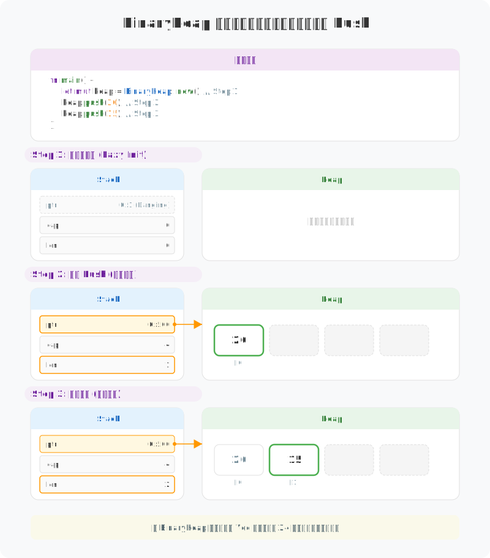
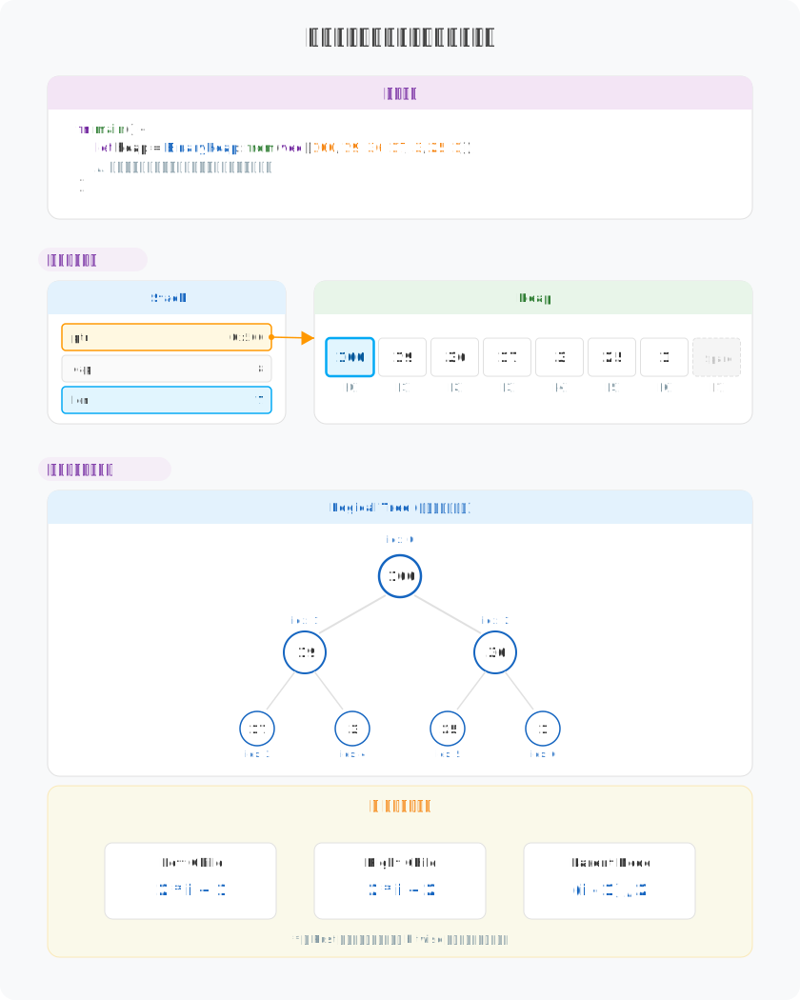
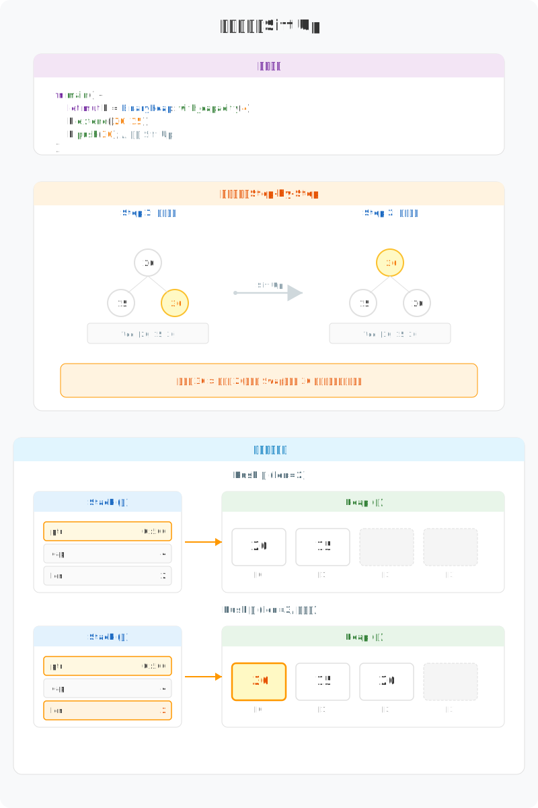
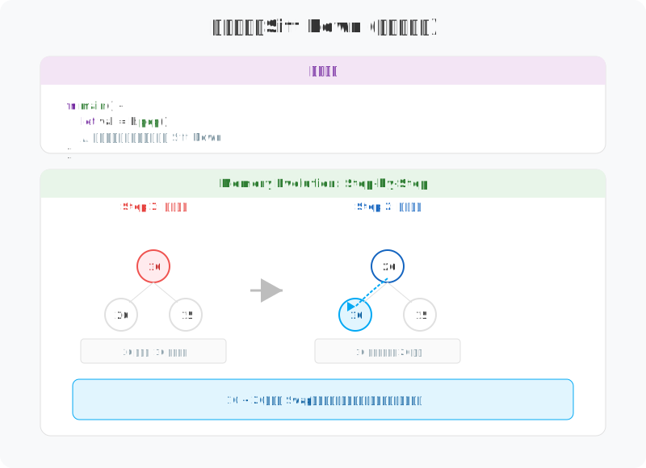

# 图解 Rust BinaryHeap：连续内存上的零开销二叉树

`BinaryHeap` 是 Rust 标准库中**优先队列**的实现。它在逻辑上是一棵二叉树，在物理上却是一个极其紧凑的 `Vec`。

---

## 1. 物理本质：隐藏在 Vec 里的树

`BinaryHeap` 的精妙之处在于它完全抛弃了指针。它利用“完全二叉树”的特性，将所有节点按层序存放在连续内存中。

---

## 2. 逻辑算法：纯数学的亲戚查找

由于树是完整的，我们不需要 `left` 或 `right` 指针，只需通过简单的算术运算即可定位父子节点。

---

## 3. 入堆行为：上浮 (Sift Up)

当新元素加入时，它首先被安插在数组末尾，然后通过不断的交换向上挑战，直到找到属于自己的位置。

---

## 4. 出堆行为：下沉 (Sift Down)

弹出堆顶（最大值）后，为了填补空缺且不破坏数组的连续性，首先将末尾元素移到堆顶，然后让它向下“沉降”。

---

## 5. 设计哲学

`BinaryHeap` 完美诠释了 Rust 的 **Zero-Cost Abstractions**：
- **物理上**：就是一个 `Vec`。利用连续内存获得极致的缓存局部性，消除了指针跳转开销。
- **逻辑上**：是一棵完全二叉树。仅靠算术运算定位父子节点，零额外存储开销。
- **操作上**：通过 `Sift Up` 和 `Sift Down` 维护堆序。默认是大顶堆，小顶堆需配合 `Reverse` 使用。

---

**创作声明**：本文以“图解”为核心，所有技术图表均由作者原创设计。文章利用 AI 工具辅助进行文字润色与纠错，以确保技术表述的严谨性与准确性。
