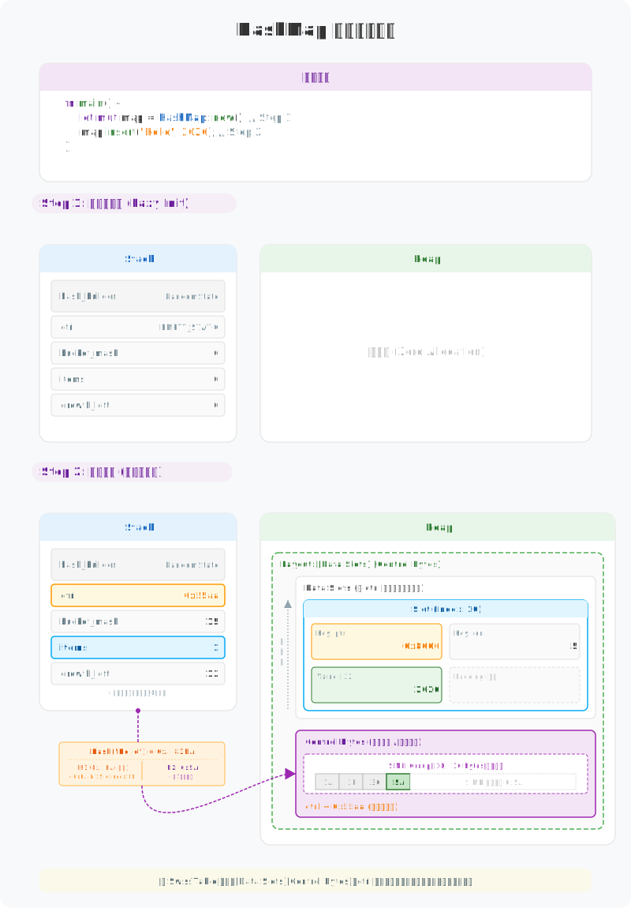

# 图解 Rust HashMap：为什么这么快？

Rust 的 `HashMap` 是标准库中极其精妙的工程实现。它并非传统的拉链法（Chaining）哈希表，而是采用了 Google 的 **Swiss Table** 设计。这种设计通过 SIMD 指令加速查找，并将元数据（Control Bytes）与数据（Slots）分离，以最大化 CPU 缓存利用率。它在物理上是“一整块连续内存”，在逻辑上则是“分组探测的哈希桶”。

---

## 1. 物理本质：元数据与数据的分离

`HashMap` 的物理布局极具特色：它将所有 buckets 的状态（Control Bytes）集中存储在数组头部，而将真正的 Key-Value 数据存储在数组尾部（或紧随其后）。

---

## 2. 逻辑算法：H1 与 H2 的分工

为了实现 SIMD 加速，Rust 将 64 位的 Hash 值拆分为两部分：**H1** 用于定位 Group，**H2** 用于组内匹配。

---

## 3. 设计哲学

Rust HashMap采用的Swiss Table 之所以高效，主要是因为它充分利用了现代 CPU 的特性：

*   **元数据分离**：它把所有桶的状态（Control Bytes）集中在一起。查找时先扫描状态数组，不需要加载冗余的 Key-Value 数据，大幅提升了 L1 Cache 的利用率。
*   **SIMD 并行匹配**：利用 CPU 指令集一次比对 16 个状态字节，从逻辑上把“逐个探测”变成了“分组并行匹配”，这是它性能领先的核心原因。

---

> **创作声明**：本文以“图解”为核心，所有技术图表均由作者原创设计。文章利用 AI 工具辅助进行文字润色与纠错，以确保技术表述的严谨性与准确性。
