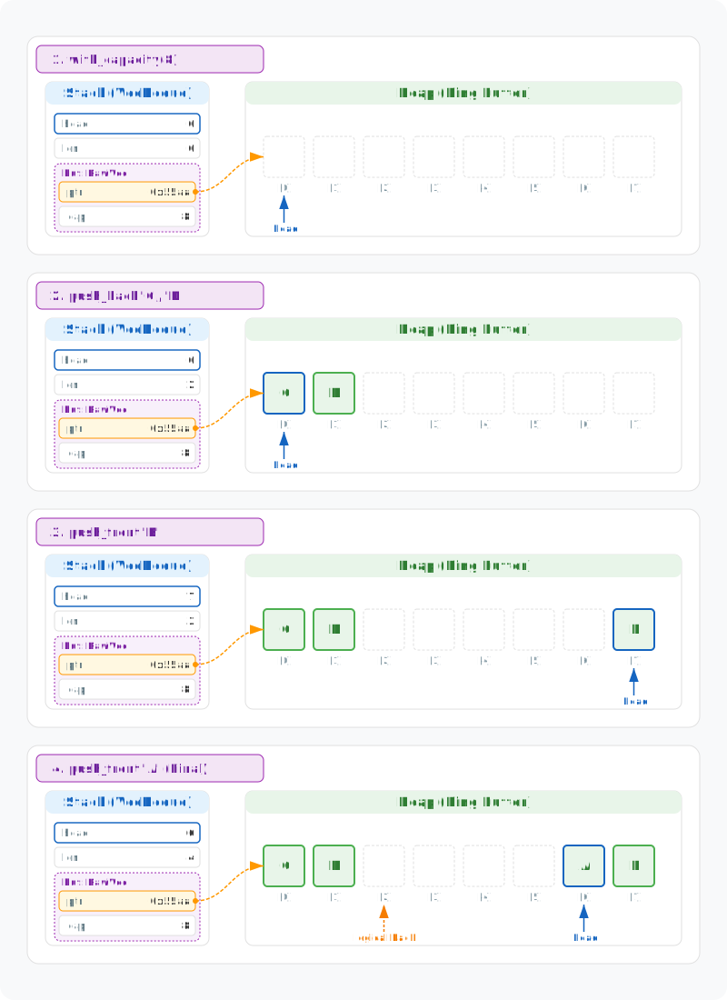
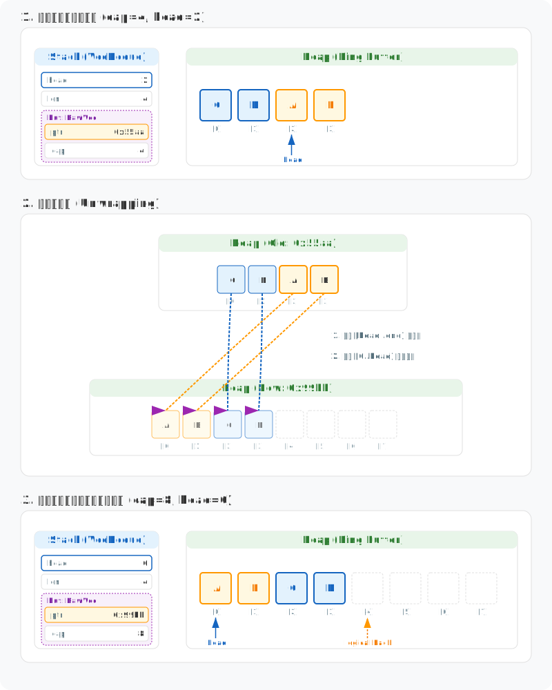
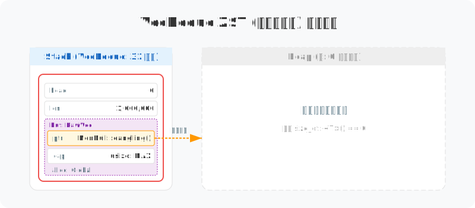
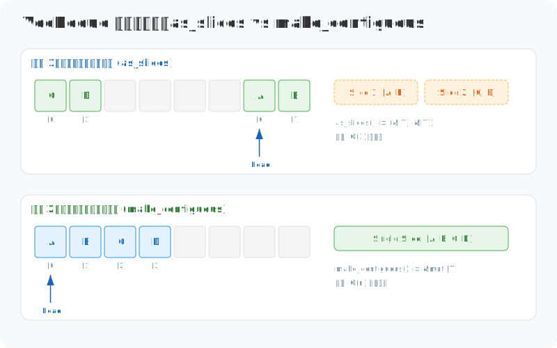

# 深度解构 Rust VecDeque：跨越物理边界的环形缓冲区

> 为什么普通的 Vec 在开头删个元素需要“全员搬家”，而 VecDeque 却能瞬间完成？这个藏在栈上的 32 字节“调度员”，是如何通过逻辑上的环形布局，把一段直线的内存空间变成灵活的双向通道？让我们看看 Rust 是如何利用位运算这种底层技巧，将性能压榨到极限的。

在 Rust 的标准库中，`VecDeque<T>` 是对动态数组的一种精妙进化。它通过牺牲一定的物理连续性，换取了双端操作的极致效率。

```rust
// 原型：VecDeque 在 64 位系统下占据 32 字节
use std::collections::VecDeque;
let mut dq = VecDeque::with_capacity(8);
dq.push_back(1);  // 尾部推入
dq.push_front(2); // 头部推入，同样是 O(1)
```

---

## 1. VecDeque的物理内存布局

在 64 位系统下，`VecDeque<T>` 在**栈（Stack）**上占据 **32 字节**（4 * 8 bytes）。与早期版本的 `head/tail` 双指针实现不同，现代 Rust 使用 `head + len` 的组合来精确描述环形状态：

```rust
pub struct VecDeque<T, A: Allocator = Global> {
    // self[0]，即队首元素在 buf 中的索引
    head: usize,
    // 队列中当前初始化的元素总数
    len: usize,
    buf: RawVec<T, A>,
}
```

```rust
// 构造一个容量为 8 的 VecDeque
let mut dq = VecDeque::with_capacity(8);
dq.push_back('C');
dq.push_back('D');
dq.push_front('B');
dq.push_front('A'); 
// 此时逻辑顺序: A, B, C, D
// 物理布局演变: [C, D, _, _, _, _, A, B]
// head = 6, len = 4
```



- **buf**: **堆内存管家**。类型为 `RawVec<T, A>`。它并不存储任何逻辑索引，只负责在堆上维护一块连续的、字节对齐的物理空间。
  - **ptr**: 内存基址，数据的“物理原点”。
  - **cap**: 物理容量。为了压榨性能，它总是被强制对齐为 2 的幂（如 8, 16, 32...）。
  
- **head**: **逻辑起点**。指向当前队列中第一个有效元素（`self[0]`）的物理索引。当头部插入数据时，它会向左侧“回绕”。

- **len**: **元素计数器**。记录队列中当前已初始化的元素总数。

>  `Vec` 采用的是“**原点固定方案**”：其 `ptr` 永远指向 `self[0]`，这使得物理地址与逻辑索引是简单的 1:1 映射，但代价是在头部增删需要移动所有元素。而 `VecDeque` 采用了“**逻辑漂移方案**”：通过 `head` 和 `len` 的组合，它解耦了逻辑起点与物理原点，从而实现了两端 $O(1)$ 的极致性能。此外，`Vec` 的容量不需要强制为 2 的幂，而 `VecDeque` 为了将索引计算优化为位运算，牺牲了内存分配的灵活性。

---

## 2. 扩容与重排：环形缓冲区的“解旋”机制

当 `len == cap` 时，`VecDeque` 必须进行扩容。这不仅仅是申请一块更大的内存（通常是原容量的 2 倍），更是一次精密的**物理重排**。

由于 `VecDeque` 是环形的，数据往往在物理内存中是“断开”的（回绕状态）。如果直接使用 `memcpy` 拷贝整块内存到新地址，逻辑上的顺序就会彻底错乱。

```rust
let mut dq = VecDeque::with_capacity(4);
dq.push_back('C');
dq.push_back('D');
dq.push_front('B');
dq.push_front('A'); 
// 此时容量已满且发生回绕: [C, D, A, B], head = 2, len = 4
dq.push_back('E'); // 触发扩容，执行“解旋”重排
```



### 扩容的三部曲：
1.  **申请新空间**：分配一块容量为原先 2 倍的新内存（例如从 4 扩容到 8）。
2.  **逻辑解旋 (Unwrapping)**：
    *   首先，将原数组中从 `head` 到物理末尾的数据（图中 A, B）拷贝到新空间的起始位置。
    *   接着，将原数组中从物理起点到 `head` 之前的数据（图中 C, D）接在后面。
3.  **重置元数据**：将 `head` 重置为 0，`len` 保持不变，`cap` 更新为新容量。

> 扩容是一个 $O(n)$ 的操作，因为它涉及所有元素的内存拷贝。通过将容量设为 2 的幂，Rust 确保了扩容触发的频率呈对数级下降，从而平摊了单次操作的开销。这种“先解旋再对齐”的策略，虽然增加了扩容时的逻辑复杂度，但换取了在正常工作状态下极高的访问效率。

---

## 3. 幽灵模式：ZST (零大小类型) 处理

对于零大小类型（ZST），`VecDeque` 与 `Vec` 一样，会进入一种“无中生有”的幽灵状态：

```rust
struct Empty;
let mut dq = VecDeque::new();
for _ in 0..1_000_000 {
    dq.push_back(Empty); // 即使 push 一百万次，也无需分配堆内存
}
```



-   **buf.ptr**: 指针被设置为一个悬空值 `NonNull::dangling()`，不产生物理访问。
-   **buf.cap**: 既然不占空间，容量理论上就是无穷大 `usize::MAX`。
-   **零开销计数**: 所有的操作本质上只是对 `head` 和 `len` 这两个整数的自增自减。

---

## 4. 连续性挑战：当逻辑顺序撞上物理断裂，你该妥协吗？

`VecDeque` 最大的“谎言”在于它让你觉得自己在用一个连续队列。实际上，为了实现 $O(1)$ 的双端增删，它不得不把数据切成两段存储在物理内存的头尾。这种“逻辑连续、物理断裂”的特性，在你需要高性能切片操作或调用 C 接口时，会成为必须面对的成本。

```rust
use std::collections::VecDeque;

let mut dq = VecDeque::with_capacity(8);
dq.push_back('C'); dq.push_back('D');
dq.push_front('B'); dq.push_front('A');
// 此时内存布局是“回绕”的：[C, D, _, _, _, _, A, B]

// 方案一：承认断裂，拿走两段切片
let (front, back) = dq.as_slices();
assert_eq!(front, &['A', 'B']); // 物理末尾的数据
assert_eq!(back, &['C', 'D']);  // 物理开头的数据

// 方案二：拒绝妥协，强制内存重排
dq.make_contiguous();
assert_eq!(dq.as_slices().0, &['A', 'B', 'C', 'D']);
// 布局恢复线性：[A, B, C, D, _, _, _, _]
```



### `as_slices`：零拷贝的真相
调用 `as_slices` 是最廉价的选择（$O(1)$），因为它只是把现有的物理分布告诉你。
- **两段论**：你拿到的不是一个 `&[T]`，而是一个元组。如果数据恰好没有回绕，第二段就是空的。
- **CPU 友好度**：虽然是零拷贝，但后续处理逻辑需要处理两次循环或分支。在进行 SIMD 优化或大规模数据处理时，这种不连续性会打断 CPU 的预取指令，带来微小的性能损失。

### `make_contiguous`：当 O(1) 变成 O(n)
如果你非要一个连续的 `&[T]`，就必须调用 `make_contiguous`。
- **内存搬迁**：它会在内部执行一系列 `ptr::copy`（类似于 `memmove`），把分散在两头的数据挪到一起。
- **代价高昂**：这是一个典型的“用空间/时间换一致性”的操作。如果你在循环中频繁调用它，`VecDeque` 相比 `Vec` 的双端优势将荡然无存。
- **所有权视角**：它返回的是 `&mut [T]`，意味着在搬迁过程中，它已经通过内部的可变引用完成了对底层物理顺序的“纠偏”。

> **底层视角**：`VecDeque` 并不是 `Vec` 的上位替代，而是一种权衡。Rust 官方库通过这两个 API 明确告诉你：要么接受物理上的不连续以换取增删效率，要么支付一次性的重排成本来获取连续性。这种“不隐瞒开销”的设计，正是系统级编程的精髓。

---

## 5. 总结：内存调度的艺术

`VecDeque` 的存在证明了：**数据结构不应该是物理内存的奴隶，而应该是它的调度员**。

通过引入 `head` 逻辑原点和 2 的幂次位运算，它在不连续的物理空间上，构建出了一个高效的双端可变抽象。它教会我们两个深刻的工程道理：
1. **解耦是性能的来源**：解耦了逻辑索引与物理原点，才有了 $O(1)$ 的双端操作。
2. **显式成本的价值**：无论是扩容时的“解旋”，还是 `make_contiguous` 的“搬迁”，Rust 从不试图掩盖这些昂贵的物理操作，而是通过 API 让你在写下代码的那一刻就知晓代价。

当你需要一个高性能的任务队列、滑动窗口缓冲区或撤销栈时，`VecDeque` 依然是你的首选。

> **声明**：本文核心观点及每张视觉图表的设计均由作者原创构思，文章内容经由 AI 辅助润色与纠错。既然工具能帮我们将思考表达得更精准，那便没必要在文字修辞上自欺欺人，让创作回归本质才是最重要的。
