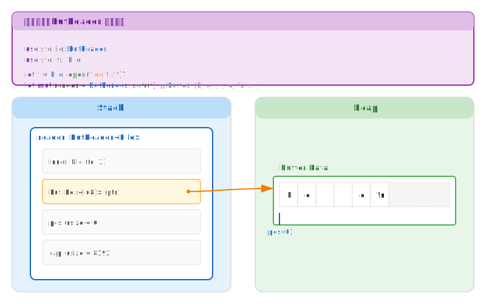
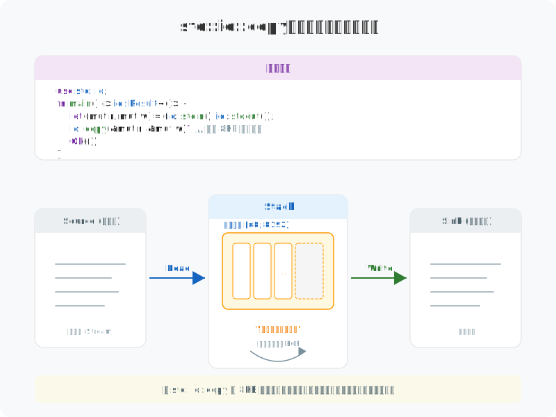
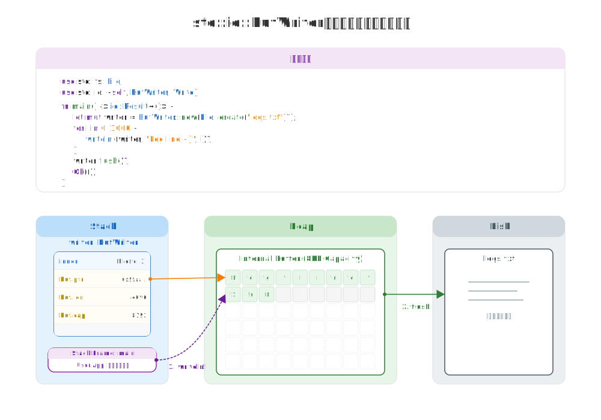

# 图解 Rust I/O：Read与Write

> **副标题：Byte Stream 的搬运工与 Buffer 的艺术**

## 引言

在 Rust 的世界里，`Read` 和 `Write` trait 是所有 I/O 操作的基石。它们不仅仅是简单的函数集合，而是对 **Byte Stream (字节流)** 这一抽象概念的精确建模。不同于 C 语言中裸露的 **File Descriptor (文件描述符)**，Rust 通过 trait 系统将文件、套接字、甚至内存缓冲区统一为相同的 **Interface (接口)**，让数据在不同介质间的流动如同水流般自然。

---

## 1. 物理本质：带状态的缓冲区

当我们谈论高效 I/O 时，不得不提 `BufReader` 和 `BufWriter`。它们并非魔法，而是通过在内存中引入一个中间层——**Buffer (缓冲区)**，来减少昂贵的 **System Call (系统调用)** 次数。

让我们看看 `BufReader` 在内存中的真实模样：

### 图解解析

1.  **Stack (栈)**：
    *   `BufReader` 结构体本身位于栈上。
    *   它包含一个 `inner` 字段，持有底层的 reader（如 `File`）。
    *   关键在于 `buf` 字段，它是一个指向堆内存的 **Fat Pointer (胖指针)**，包含 `ptr` (地址)、`cap` (容量) 和 `len` (长度)。
    *   `pos` 和 `cap` 两个 `usize` 字段分别记录当前读取 cursor 和缓冲区内的有效数据量。

2.  **Heap (堆)**：
    *   实际的数据存储在堆上的连续内存块 (**Contiguous Memory Block**) 中。
    *   这块内存充当了用户代码与操作系统之间的 **Intermediate Buffer (中间缓冲)**。

这种物理结构决定了 `BufReader` 的高效性：多次小的 `read` 调用可以直接从堆上的缓冲区拿数据 (**Memory Copy**)，只有当缓冲区 **Exhausted (耗尽)** 时，才会触发真正的 `read` syscall 去 **Refill (填充)** 它。

---

## 2. 逻辑算法：流式搬运

从逻辑层面看，I/O 操作本质上是数据从一个 **Source (源)** 流向一个 **Sink (汇)** 的过程。Rust 的 `Read` 和 `Write` trait 定义了这种流动的 **Semantics (语义)**。

下图展示了一个经典的 `copy` 操作的数据流向：

### 核心逻辑

1.  **Read 侧**：
    *   调用 `read()` 方法时，数据首先从外部 Source（如文件）被加载到用户提供的缓冲区中。
    *   `Read` trait 并不关心缓冲区是在栈上还是堆上，它只关心 `&mut [u8]` 这个 **Mutable Slice (可变切片)**。

2.  **Write 侧**：
    *   拿到数据后，`write_all()` 负责将缓冲区的内容全部写入 Target Sink。
    *   这个过程在一个循环中不断重复，直到 Source 返回 `EOF` (`n == 0`)。

这种设计将“搬运”逻辑与具体的 **Implementors (实现者)**（File, TcpStream, Vec<u8>）解耦，体现了 Rust **Generics (泛型)** 与 **Trait Bound** 的强大威力。

---

## 3. 核心行为：缓冲与刷新

对于写入操作，`BufWriter` 的行为稍有不同。它像一个大坝，拦截了细小的水流，直到水位达到警戒线才开闸放水。

### 行为拆解

1.  **Write (Buffering)**：
    *   当你调用 `writer.write(b"hello")` 时，数据并没有立即到达磁盘。
    *   数据只是被 `memcpy` 到了内部的缓冲区中。
    *   **关键点**：此时没有发生 **Syscall**，属于 **User Space** 操作，速度极快。

2.  **Flush (Flushing)**：
    *   当缓冲区满了，或者你显式调用 `writer.flush()`，或者 `BufWriter` 被 **Drop** 时。
    *   积攒的数据被一次性写入底层的 Writer（如磁盘文件）。
    *   这一步才会真正触发昂贵的 I/O 操作。

这种机制极大地提升了频繁小写入场景下的性能，但同时也引入了数据一致性的风险：如果程序崩溃且未 Flush，缓冲区的数据将会丢失。

---

## 4. 设计哲学

Rust 的 I/O 系统设计深刻体现了其核心哲学：

*   **物理上 (Zero-Cost Abstractions)**：
    *   `Read`/`Write` trait 的方法默认是 **Static Dispatch (静态分发)**，直接映射到系统调用或内存操作，没有 **Dynamic Dispatch Overhead (虚函数开销)**（除非显式使用 `dyn Read` 这样的 **Trait Object**）。
    *   缓冲区管理（如 `BufReader`）显式暴露，让用户自己权衡 **Memory Footprint (内存占用)** 与 I/O 频率。

*   **逻辑上 (Type Safety & Ownership)**：
    *   通过 **Ownership & Borrowing (所有权与借用)** 规则，防止了缓冲区在读取过程中被意外修改（Data Race Free）。
    *   `Result` 类型强制处理 I/O 错误，杜绝了被忽略的 `errno`。

*   **操作上 (Explicit Control)**：
    *   缓冲是显式的（通过 `BufReader`/`BufWriter` 包装），而不是像某些语言那样隐式内置。
    *   这给予了开发者对性能特性的完全控制权。

---

> **创作声明**：本文以“图解”为核心，所有技术图表均由作者原创设计。文章利用 AI 工具辅助进行文字润色与纠错，以确保技术表述的严谨性与准确性。
