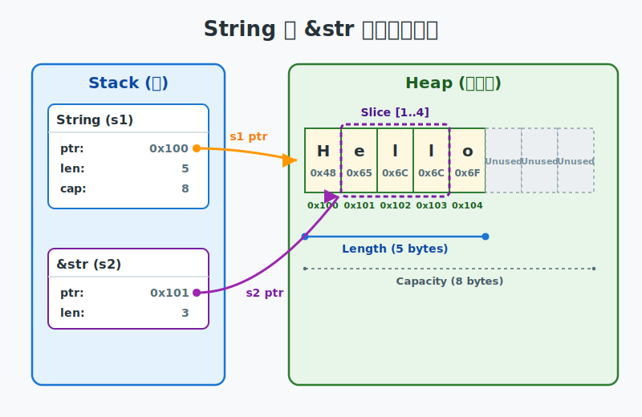
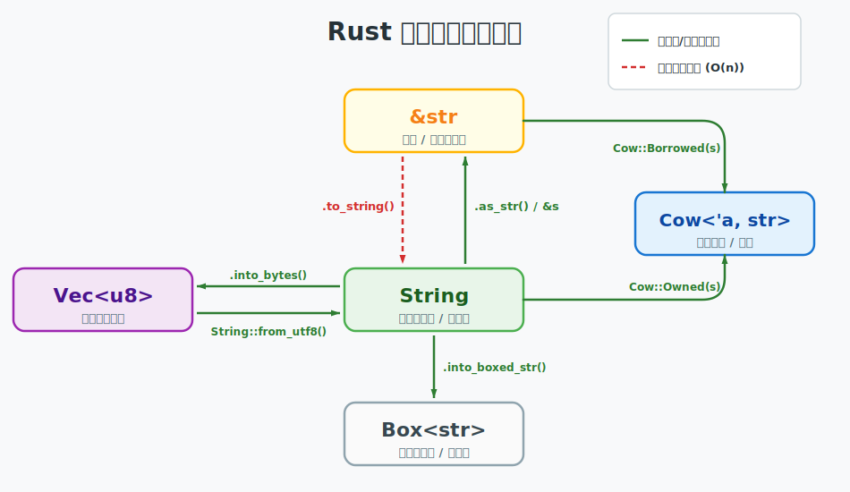

# 图解Rust系列：String 内存布局与编码之美

在 Rust 中，字符串并不是一个简单的类型，而是由多种形态构成的生态系统。理解它们的内存布局和编码机制，是掌握 Rust 所有权与借用的关键。

## String 与 &str 的内存布局

Rust 的字符串在内存中呈现出清晰的元数据与数据分离结构。

```rust
let s1 = String::from("Hello"); // String: Stack 包含指针、长度、容量
let s2 = &s1[1..4];             // &str: Fat Pointer 包含指针、长度 (指向 "ell")
```



- **String**：拥有所有权的动态增长容器。它在 Stack 上占用 24 字节（64位系统），封装了指向堆内存的指针（ptr）、当前字节长度（len）和最大分配容量（cap）。
- **&str**：字符串切片。本质上是一个“胖指针”（Fat Pointer），在 Stack 上占用 16 字节，包含指向数据起始处的指针和有效长度。它不持有所有权，仅提供对现有数据的观察窗口。

## 维度的冲突：编码如何重塑访问方式

既然 `String` 和 `&str` 的底层都是连续内存，为什么 Rust 不允许像 C 语言那样通过 `s[0]` 直接索引？这并非刻意刁难，而是为了在多语言编码的复杂性中寻找性能与安全的平衡点。

```rust
let s = "Hi🦀";

// ❌ 禁止产生歧义的下标访问
// let char = s[2]; 

// ✅ 字节维度：明确获取原始数据
let byte = s.as_bytes()[2]; // 0xF0

// ✅ 字符维度：明确获取 Unicode 标量值
let second_char = s.chars().nth(2); // Some('🦀')
```


- **变长编码的挑战**：在 UTF-8 编码中，单个字符可能跨越 1-4 个字节。若允许按字节下标访问，极易在字符边界中间产生非法截断（Truncation），导致数据损坏；若按字符索引，则需 O(n) 遍历，违背了零成本抽象（Zero-cost Abstractions）原则。
- **语义的明确性**：C 语言将字符串视为裸字节数组，追求极致速度但留下了安全隐患。Rust 则强制开发者显式选择访问的“维度”：

## 游走于多形态间：常用转换路径

正是由于 Rust 对编码安全性的严格把控，以及对所有权归属的明确要求，开发者往往需要在不同形态的字符串之间游走。理解这些转换的“开销”及其底层内存结构的变化，是编写高性能 Rust 代码的前提。

```rust
use std::borrow::Cow;

fn main() {
    // 1. 廉价的借用与重解释
    let s = String::from("Rust");
    let slice: &str = &s;                // O(1) Deref 转换
    let bytes: Vec<u8> = s.into_bytes(); // O(1) 仅转移所有权并重解释

    // 2. 涉及内存分配的克隆
    let s_owned = slice.to_string();     // O(n) 触发堆内存分配

    // 3. Cow 的智慧：按需分配
    let input = "Visual Rust";
    let mut cow: Cow<str> = Cow::Borrowed(input); 
    // 此时 cow 仅持有借用，无堆内存分配
    
    let _ = cow.to_mut(); // 此时才真正触发堆分配 (O(n))
}
```

### 转换全景图



### 宏观与微观：转换背后的内存真相

全景图展示了“如何转换”，而要理解“为何这样转”，我们需要将镜头推近，观察栈与堆在微观世界中的数据流转。


1. **&str ➜ String (所有权提升)**：这是从“借用”到“拥有”的质变。由于 `&str` 并不持有底层数据的所有权，转换时必须在堆上分配新空间，并完成数据的全量克隆（Clone）。这是一个 **O(n)** 操作。
2. **String ➜ &str (借用降级)**：通常通过 `Deref` 隐式转换或 `as_str()` 实现。它仅在栈上创建一个新的胖指针，指向 `String` 已有的堆内存。这是一个极其廉价的 **O(1)** 操作。
3. **String ➜ Vec<u8> (零成本解包)**：由于 `String` 本质上是对 `Vec<u8>` 的 UTF-8 约束包装，此转换仅涉及所有权的平移。编译器在栈上重新解释数据类型，不涉及内存分配或数据移动。这是一个 **O(1)** 操作。
4. **String ➜ Box<str> (内存收紧)**：`String` 为支持动态增长通常保留了超额容量（Capacity）。`Box<str>` 则是定长的，转换时会执行 `shrink_to_fit` 以释放冗余空间。若 `len < cap`，会触发一次内存重分配。
5. **Cow 模式 (智慧的写时克隆)**：`Cow` (Copy-on-Write) 是 Rust 零成本抽象的典范。在只读场景下表现为 `&str` 借用，仅在发生修改时才延迟触发堆内存分配与克隆。它在灵活性与性能间取得了完美平衡。

---

## 底层心法

从内存布局到编码抉择，再到形态转换，Rust 字符串的设计始终围绕着“所有权”与“性能”的博弈。

**String 是掌管生命周期的动态容器，而 &str 是透视内存的零成本视角。**
理解两者的权责边界，是你从“写代码”进化到“设计内存布局”的关键一步。
