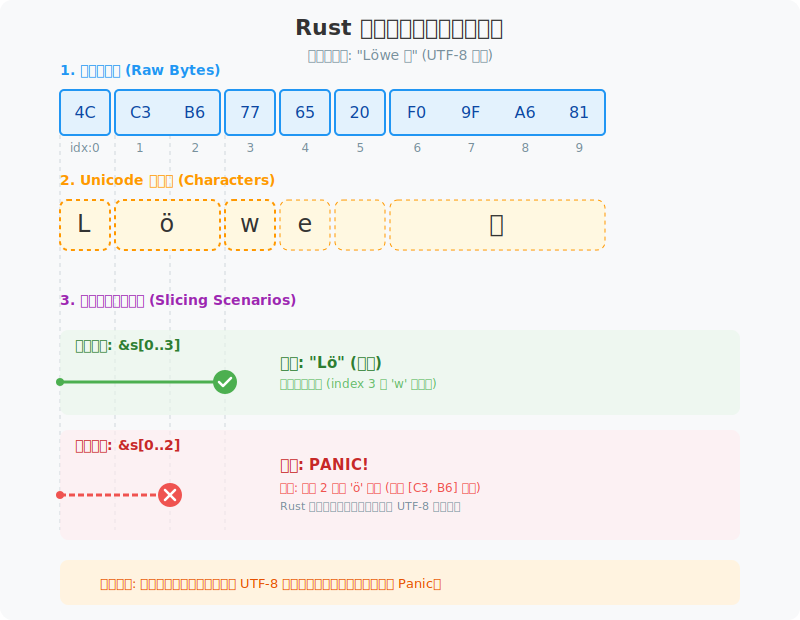

# 图解 Rust 字符串：内存布局与类型转换

在 Rust 中，字符串并非单一类型，而是由多种形态构成的。理解它们的内存布局和编码机制，是掌握 Rust 所有权与借用的基础。

## String 与 &str 的内存布局

Rust 字符串在内存中通过元数据与实际数据分离的方式存储。

```rust
let s1 = String::from("Hello"); // String: 栈上包含指针、长度、容量
let s2 = &s1[1..4];             // &str: 胖指针，包含指针、长度（指向 "ell"）
```


- **String**：拥有所有权的动态增长容器。它在栈（Stack）上占用 24 字节（64位系统），包含指向堆内存的指针（ptr）、当前字节长度（len）和分配容量（cap）。
- **&str**：字符串切片，本质是一个“胖指针”（Fat Pointer）。它在栈上占用 16 字节，包含指向数据起始处的指针和有效长度。它不持有所有权，仅提供对现有数据的观察视角。

## 为什么 Rust 不支持下标访问？

既然 `String` 和 `&str` 底层都是连续内存，为什么不能通过 `s[0]` 直接索引？这主要是为了处理 UTF-8 编码的复杂性。

```rust
let s = "Hi🦀";

// ❌ 编译错误：Rust 禁止直接下标访问，以避免语义歧义
// let char = s[2]; 

// ✅ 字节维度：获取原始字节
let byte = s.as_bytes()[2]; // 0xF0

// ✅ 字符维度：按 Unicode 标量值迭代
let second_char = s.chars().nth(2); // Some('🦀')
```


- **变长编码限制**：UTF-8 中，单个字符可能占用 1-4 个字节。按字节索引可能截断字符（导致非法 UTF-8），而按字符索引则需要 O(n) 的遍历开销，违背了 Rust “零成本抽象”的原则。
- **显式访问**：Rust 强制开发者显式选择访问维度（字节、字符或字形簇），从而在性能和安全性之间取得平衡。

## 字符串切片与安全边界

虽然 Rust 禁止通过 `s[i]` 进行下标访问，但允许通过 `&s[i..j]` 进行切片。这提供了一种获取字符串局部视图的手段，但也引入了运行时崩溃的风险。

```rust
let s = "Löwe 🦁";

// ✅ 正确切片：Lö 在 UTF-8 中占用 3 个字节（L:1, ö:2）
let slice1 = &s[0..3]; 

// ❌ 运行时崩溃：切片边界必须落在字符的合法边界上
// let slice2 = &s[0..2]; // 'ö' 占用 2 字节，切在中间会触发 panic
```



- **边界检查**：与 C 语言不同，Rust 的字符串切片在运行时会校验边界。如果起始或结束索引切在了一个多字节字符的中间，程序会直接崩溃（Panic）。
- **性能与安全的折中**：这种设计保留了 **O(1)** 的操作效率（仅需调整指针和长度），同时通过运行时强制校验确保了生成的 `&str` 永远是合法的 UTF-8。在处理不确定来源的字符串时，建议配合 `.char_indices()` 等迭代器来寻找安全的切割点。

## 字符串形态转换

在实际开发中，经常需要在不同字符串形态之间转换。理解这些转换的开销和内存变化至关重要。

```rust
use std::borrow::Cow;

fn main() {
    // 1. O(1) 转换
    let s = String::from("Rust");
    let slice: &str = &s;                // Deref 转换
    let bytes: Vec<u8> = s.into_bytes(); // 仅转移所有权，无内存重新分配

    // 2. 涉及内存分配的转换 (O(n))
    let s_owned = slice.to_string();     // 触发堆内存分配和数据拷贝

    // 3. Cow (Copy-on-Write) 按需分配
    let input = "Visual Rust";
    let mut cow: Cow<str> = Cow::Borrowed(input); 
    // 初始状态仅持有借用，不分配堆内存
    
    let _ = cow.to_mut(); // 只有在需要修改时才触发堆分配 (O(n))
}
```

### 转换全景图


### 转换背后的内存细节


1. **&str ➜ String**：从“借用”到“拥有”。由于 `&str` 不持有数据，转换时必须在堆上分配新空间并拷贝全量数据。这是一个 **O(n)** 操作。
2. **String ➜ &str**：借用降级。通过 `Deref` 隐式转换或 `as_str()` 实现，仅在栈上创建一个指向堆内存的胖指针。这是一个 **O(1)** 操作。
3. **String ➜ Vec<u8>**：所有权平移。`String` 本质上是 `Vec<u8>` 的封装，转换仅涉及类型重新解释，不涉及数据移动。这是一个 **O(1)** 操作。
4. **String ➜ Box<str>**：收紧内存。`String` 通常有冗余容量，转换为 `Box<str>` 会执行 `shrink_to_fit` 释放多余空间，可能触发内存重分配。
5. **Cow (Copy-on-Write)**：在只读场景下作为 `&str` 存在，仅在发生修改时才延迟触发堆分配。这是处理可选所有权的常用模式。

---

## 总结

Rust 字符串的设计体现了所有权与性能的权衡：**String 是管理生命周期的容器，而 &str 是高效观察内存的窗口。** 明确两者的职责边界，能帮助我们写出更高效、内存更安全的 Rust 代码。
