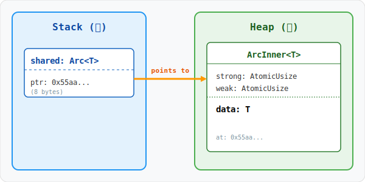

# 图解 Rust：Arc<T> (Atomic Reference Counted)

在 Rust 的并发世界中，`Arc<T>` (Atomic Reference Counted) 是处理多线程所有权共享的“瑞士军刀”。如果你曾因 `Rc<T>` 无法在线程间安全传递而苦恼，或者在 C++ 中因 `std::shared_ptr` 的线程安全边界模糊而踩坑，那么深入理解 `Arc` 的设计哲学将是你迈向 Rust 并发高手的必经之路。

## 1. 为什么需要 Arc？

在单线程环境下，`Rc<T>` 表现完美。但当我们尝试将所有权分发给多个线程时：

```rust
use std::rc::Rc;
use std::thread;

fn main() {
    let data = Rc::new(vec![1, 2, 3]);
    for _ in 0..3 {
        let data_clone = data.clone();
        thread::spawn(move || {
            println!("{:?}", data_clone);
        });
    }
}
```

编译器会无情报错：`Rc<Vec<i32>>` cannot be sent between threads safely (`Send` trait is not implemented).


**原因分析**：`Rc` 的引用计数更新是非原子的。如果两个线程同时克隆 `Rc`，可能会导致引用计数竞态，最终造成内存泄漏或提前释放（Use-after-free）。`Arc` 正是为了解决这一安全隐患，通过硬件级的**原子指令**（Atomic Instructions）保证了计数的线程安全性。

## 2. 多线程共享状态

```rust
use std::sync::Arc;
use std::thread;

fn main() {
    // 将数据包裹在 Arc 中
    let shared_data = Arc::new(vec![1, 2, 3]);
    let mut handles = vec![];

    for i in 0..3 {
        let data_clone = Arc::clone(&shared_data);
        let handle = thread::spawn(move || {
            // data_clone 拥有数据的所有权（共享）
            println!("Thread {}: {:?}", i, data_clone);
        });
        handles.push(handle);
    }

    for handle in handles {
        handle.join().unwrap();
    }
}
```


## 3. 内存布局深度剖析

`Arc<T>` 在内存中究竟是如何分布的？理解这一点对优化性能至关重要。



**关键点解读**：
- **双计数器**：`ArcInner` 包含 `strong` 和 `weak` 两个原子计数器。只有当 `strong` 归零时，数据 `T` 才会被析构；只有当 `strong` 和 `weak` 同时归零时，整个 `ArcInner` 内存块才会被释放。
- **内存屏障**：由于使用了原子操作（通常是 `Relaxed` 增加和 `Release/Acquire` 减少），`Arc` 在计数更新时会同步内存状态，确保线程间的数据可见性。

## 4. Arc 不是万能药

### T is not Sync
即使包裹在 `Arc` 中，如果 `T` 本身没有实现 `Sync`（例如 `RefCell`），你依然无法在多线程间通过 `&Arc<T>` 共享。
- **解法**：通常需要组合 `Arc<Mutex<T>>` 或 `Arc<RwLock<T>>` 来提供内部可变性。

### 循环引用
`Arc` 无法自动处理循环引用（A 指向 B，B 指向 A）。
- **解法**：使用 `Weak<T>` 打破循环。`Weak` 不增加 `strong` 计数，不会阻止数据的销毁。


## 5. 最佳实践

**在生产环境中，遵循“按需共享”原则**：
1. 优先考虑通过通道（Channel）传递所有权。
2. 当且仅当多个线程需要**同时读取**同一份大型只读数据时，使用 `Arc`。
3. 避免过度深拷贝，利用 `Arc::clone` 仅复制指针和递增原子的廉价特性。
