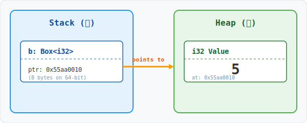
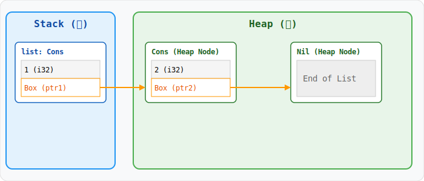
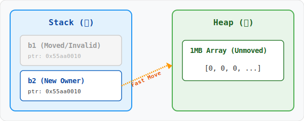
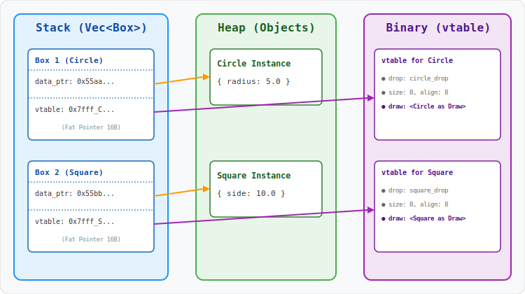

# Box<T>：堆内存分配的基石

在 Rust 的内存管理体系中，`Box<T>` 是最简单也最核心的智能指针。它不具备 `Rc` 的引用计数，也没有 `RefCell` 的运行时借用检查，它的唯一职责就是：**将数据从栈（Stack）移动到堆（Heap）**。

## 1. 为什么需要 Box？

在 Rust 中，大多数数据默认分配在栈上。栈内存分配效率极高，但有两个致命限制：
1. **大小必须固定**：编译器必须在编译阶段精确知道类型的大小。
2. **所有权生命周期**：栈上的数据随着函数调用的结束而销毁。

`Box<T>` 解决了这些问题，它允许你在堆上存储数据，而仅在栈上保留一个指向该数据的指针（即 `Box` 结构体本身）。

## 2. 内存布局剖析

当我们执行 `let b = Box::new(5);` 时，内存中发生了什么？



- **栈上（Stack）**：`Box` 本身是一个指针，大小为 `usize`（64位系统下为 8 字节）。

- **栈上（Stack）**：`Box` 本身是一个指针，大小为 `usize`（64位系统下为 8 字节）。
- **堆上（Heap）**：存储着实际的数据 `T`。
- **所有权**：当 `Box` 离开作用域时，它的 `Drop` 实现会自动释放堆内存。

## 3. 核心应用场景

### 3.1 打破递归类型的无限大小

Rust 必须在编译时知道类型的大小。考虑一个简单的链表：

```rust
// ❌ 编译错误：recursive type `List` has infinite size
enum List {
    Cons(i32, List),
    Nil,
}
```

**解决方案：使用 `Box` 指针**

```rust
enum List {
    Cons(i32, Box<List>),
    Nil,
}

use List::{Cons, Nil};

fn main() {
    let list = Cons(1, Box::new(Cons(2, Box::new(Nil))));
}
```



通过引入 `Box`，`Cons` 变体的大小变成了 `i32` + `usize`。无论链表多长，每个节点的大小都是固定的。

### 3.2 转移大数据的所有权

如果你有一个巨大的数组（例如 `[u8; 1024 * 1024]`），在函数间传递它会触发昂贵的栈拷贝。使用 `Box` 后，数据被存储在堆上，而在栈上流转的只有 8 字节（64位系统）的指针，这使得所有权转移极其高效。

```rust
fn main() {
    // 1. 在堆上分配 1MB 的数组
    let b1 = Box::new([0u8; 1024 * 1024]);
    
    // 2. 转移所有权给 b2
    // 仅拷贝了指针（8 字节），堆上的 1MB 数据保持原位不动
    let b2 = b1; 
    
    // println!("{:?}", b1); // 编译错误：b1 的所有权已转移，其指针已失效
}
```



### 3.3 Trait 对象与动态分发

由于不同类型的大小在编译时各异，编译器无法直接在栈上分配 `dyn Trait` 这种 **DST（动态大小类型）**。`Box<dyn Trait>` 通过在堆上存储数据，并在栈上提供一个 **胖指针 (Fat Pointer)** 解决了这一问题。

该胖指针占用两个 `usize`：一个指向堆上的 **具体数据**，另一个指向 **虚函数表 (vtable)**。

```rust
trait Drawable { fn draw(&self); }

struct Circle { radius: f64 }
impl Drawable for Circle { 
    fn draw(&self) { println!("Drawing Circle"); } 
}

struct Square { side: f64 }
impl Drawable for Square { 
    fn draw(&self) { println!("Drawing Square"); } 
}

fn main() {
    // 1. 单个 Trait 对象：Box 内部存储了指向 Circle 的数据指针和 Drawable 的 vtable
    let shape: Box<dyn Drawable> = Box::new(Circle { radius: 5.0 });
    shape.draw();

    // 2. 类型擦除：将不同具体类型封装进 Box，统一存入 Vec
    let shapes: Vec<Box<dyn Drawable>> = vec![
        Box::new(Circle { radius: 2.0 }),
        Box::new(Square { side: 3.0 }),
    ];
}
```



## 4. 避坑指南：Deref 强制转换

`Box<T>` 实现了 `Deref` 特型，这意味着你可以直接在 `Box` 上调用 `T` 的方法。但在处理 Trait 对象时，注意所有权的转移。

## 5. 最佳实践

> **优先使用栈。只有在需要“递归类型”、“避免大数据拷贝”或“Trait 对象动态分发”时，才使用 `Box`。**
