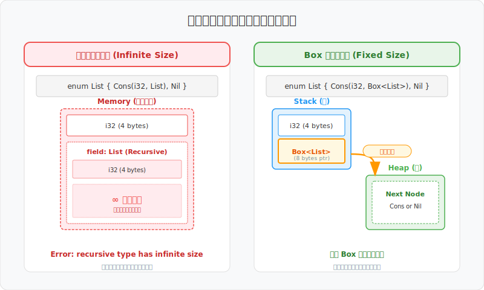
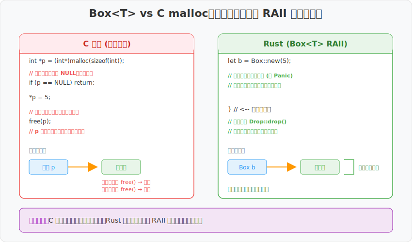
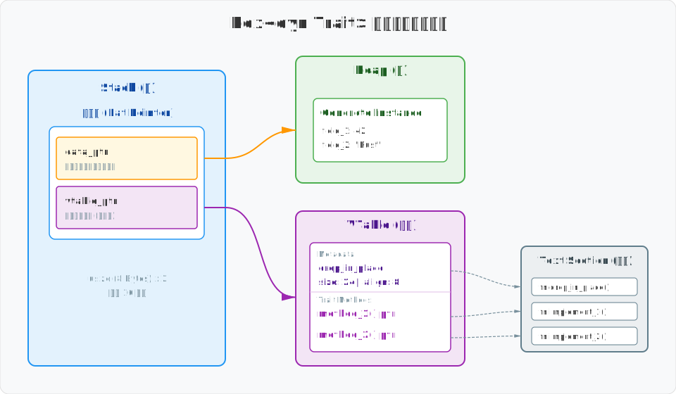
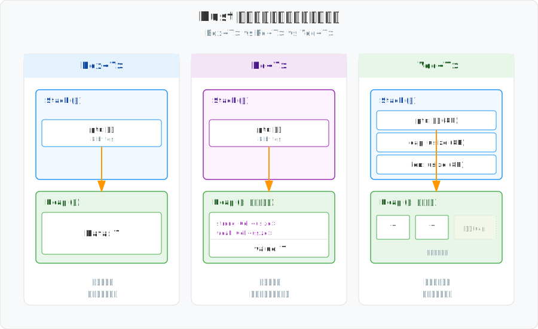

# 图解 Rust：智能指针 Box —— 堆内存分配与尺寸适配的艺术

## 目录
- [1. 堆分配的本质：打破栈的尺寸限制](#1-堆分配的本质打破栈的尺寸限制)
- [2. 递归类型：利用间接层跨越“无限尺寸”](#2-递归类型利用间接层跨越无限尺寸)
- [3. RAII 机制：比 C 更安全的堆内存管理](#3-raii-机制比-c-更安全的堆内存管理)
- [4. 抹平类型差异：Trait 对象的“尺寸适配器”](#4-抹平类型差异trait-对象的尺寸适配器)
- [5. 性能权衡：在效率与灵活性之间寻找平衡](#5-性能权衡在效率与灵活性之间寻找平衡)
- [总结](#总结)

在 Rust 中，如果你想将数据分配到堆上，最直接的选择就是 `Box<T>`。与自动管理内存且带有垃圾回收（GC）的语言不同，Rust 允许开发者显式控制数据的内存布局。`Box` 提供了一种极其轻量的堆分配方式，几乎没有运行时开销。

这种对内存布局的显式掌控，是 Rust 实现高效代码和处理复杂数据结构的基础。

---

## 1. 堆分配的本质：打破栈的尺寸限制

`Box<T>` 是 Rust 中最基础的智能指针。它不包含引用计数或复杂的运行时检查，其核心功能非常明确：**在栈上存储一个固定大小的地址，而将数据本体保存在堆中。**

### 8 字节的栈空间
在 64 位系统下，无论 `Box` 内部装载的数据量有多大，它在栈上占用的空间永远是固定的 **8 字节**。这 8 字节存储的就是指向堆内存的地址。

```rust
let b = Box::new(5); // 数据 5 被分配到堆上，栈上的 b 仅保存该地址
```

从实现角度看，`Box` 就是对原始指针的一个安全封装。它利用 Rust 的所有权系统确保了内存的安全性，同时保留了指针的高效性。

### 内存布局
`Box` 的内存布局非常直观：


- **栈（Stack）**：存储一个指针，其值为堆内存的起始地址。
- **堆（Heap）**：存储具体的类型 `T`。
- **所有权**：`Box` 拥有该堆内存的独占所有权。当 `Box` 变量离开作用域时，堆内存会通过 `Drop` trait 被立即释放。

---

## 2. 递归类型：利用间接层跨越“无限尺寸”

Rust 编译器要求在编译期确定每个类型的大小（即 `Sized` 特性）。对于递归类型（即类型内部直接包含其自身），这会导致一个逻辑矛盾：为了计算外层的大小，必须先知道内层的大小，而内层又包含更内层，陷入无限循环。

### 无限尺寸的问题
考虑下面的链表定义：
```rust
enum List {
    Cons(i32, List), // ❌ 错误：List 内部包含 List，导致尺寸无法计算
    Nil,
}
```
由于 `List` 的定义是递归的，编译器无法预先计算出它在内存中需要占用多少字节。

### 通过间接层解决
`Box` 通过引入间接层（Indirection）解决了这个问题。当我们将定义改为 `Box<List>` 时，编译器看到的不再是一个无限嵌套的结构，而是一个 **8 字节的固定指针**。



- **左侧**：直接递归定义会导致类型尺寸理论上趋于无限，编译器无法为其分配栈空间。
- **右侧**：`Box` 将递归的层级从栈转移到了堆内存链条中。

> **💡 技术深度解析：堆上的大小真的不需要确定吗？**
> 
> 这是一个常见的疑问：既然递归最终在堆上，难道堆内存就不需要确定大小吗？
> 
> 这里的关键在于 **“类型大小”与“实例总大小”的解耦**：
> 1. **编译期确定性**：编译器必须知道 `List` 这个类型本身占用的空间（用于栈分配、结构体对齐等）。使用 `Box` 后，`List` 类型的大小变成了 `i32` + `指针`，这是固定的。
> 2. **运行时动态性**：链表的总长度（即堆上分配的总空间）是在运行时决定的。编译器并不关心你运行时会链接多少个 `Box`，它只关心每一个 `Cons` 节点在被创建时，需要向堆申请多少内存。
> 3. **单次分配的确定性**：当你执行 `Box::new(List::Cons(..))` 时，系统分配的是**一个**节点的大小。这个大小在编译期是完全可知的。
> 
> 简而言之：**堆允许数据在运行时动态增长，但编译器要求每一个“数据块”的模版（类型）必须有确定的边界。**

---

## 3. RAII 机制：比 C 更安全的堆内存管理

如果你熟悉 C 语言中的 `malloc` 和 `free`，就能更清晰地理解 `Box` 的价值。`Box` 实际上是 Rust 对堆内存分配的一种安全抽象。

### 自动化管理与所有权
在 C 语言中，手动管理内存极易导致内存泄漏或双重释放（double free）。



- **C 语言**：需要手动计算内存大小、检查分配结果并在合适的时机释放。
- **Rust (Box)**：遵循 RAII（资源获取即初始化）原则。`Box::new` 负责分配，作用域结束时自动释放。

这种机制保证了 `Box` 在拥有 C 语言级性能的同时，在编译期就规避了常见的内存安全风险。

---

## 4. 抹平类型差异：Trait 对象的“尺寸适配器”

前面讨论的场景中，`Box` 包装的都是具体的、已知大小的类型。然而，`Box` 还有一个极其关键的使命：处理那些在编译期大小不可知的 **Trait 对象（Trait Objects）**。

正如它解决递归类型尺寸问题的方式一样，`Box` 再次充当了“尺寸适配器”的角色。它将不同大小的实现类统一包装成固定大小的指针，从而支持运行时的动态分发。在这种场景下，`Box` 会以 **胖指针（Fat Pointer）** 的形式存在。

### 虚函数表 (vtable)
一个 `Box<dyn Trait>` 在栈上占用 **16 字节**（即两个指针的大小）：
1. **数据指针**：指向堆上的具体数据实例。
2. **虚表指针**：指向该类型的 vtable，其中存储了 Trait 方法的具体函数地址。



这种设计支持了运行时的动态分发。虽然相比静态分发增加了一次寻址开销，但它为程序架构提供了必要的灵活性。

---

## 5. 性能权衡：在效率与灵活性之间寻找平衡

在理解了 `Box` 的内存布局和各种应用场景后，我们必须回到一个核心问题：在实际开发中，我们应该在什么时候、以什么样的代价去使用它？

- **分配成本**：`Box::new` 涉及堆内存分配，这是一个系统调用。在对性能极度敏感的紧凑循环中，应避免频繁创建和销毁 `Box`。
- **移动（Move）开销**：对于极大的结构体（例如大型数组），在函数间直接传递会导致大量的栈拷贝。使用 `Box` 后，仅需传递 8 字节的指针，能显著提升性能。

### 容器对比
了解 `Box` 与其他容器在内存布局上的差异，有助于做出更优的选择：



- **Box**：独占所有权的堆分配，内存开销最小。
- **Rc**：为了支持共享所有权，在堆上增加了引用计数元数据。注意，`Rc<T>` 并不等同于 `Rc<Box<T>>`，它会将引用计数与数据 `T` 放在同一个堆分配块中，以避免双重寻址。
- **Vec**：为了支持动态伸缩，在栈上维护了 `length` 和 `capacity` 字段。

## 总结

`Box<T>` 并不是魔法，它是 Rust 对堆内存地址的一种**极其透明且克制**的封装。

- **逻辑层**：利用所有权和 RAII 机制确保内存安全。
- **物理层**：保持了与原始指针几乎一致的内存布局。

**何时使用 Box？** 当你需要处理递归类型、减少大数据块的拷贝开销，或者需要使用 Trait 对象实现动态分发时。除此之外，优先使用栈分配通常是更好的默认选择。
