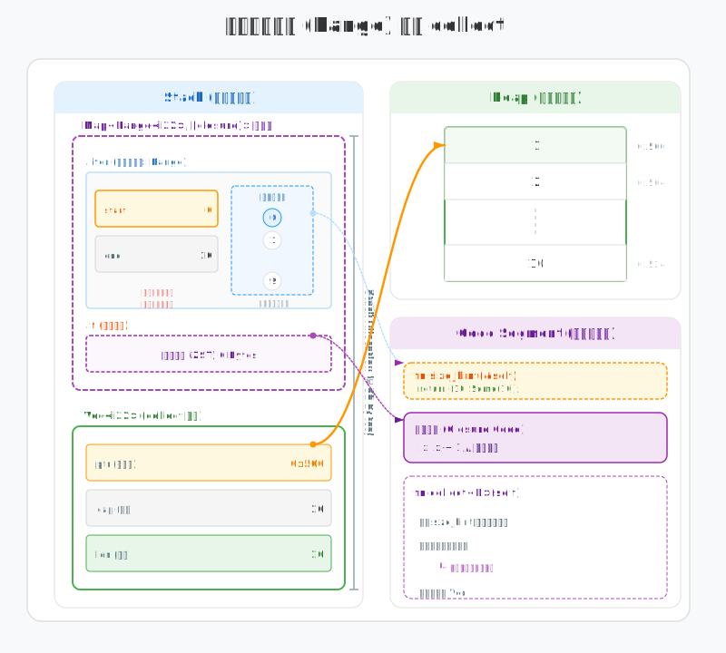
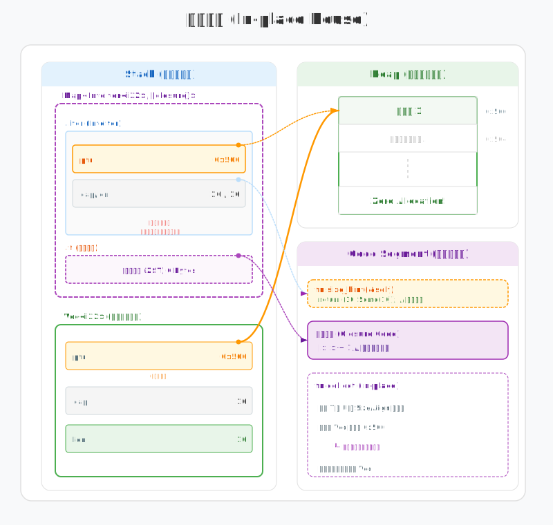
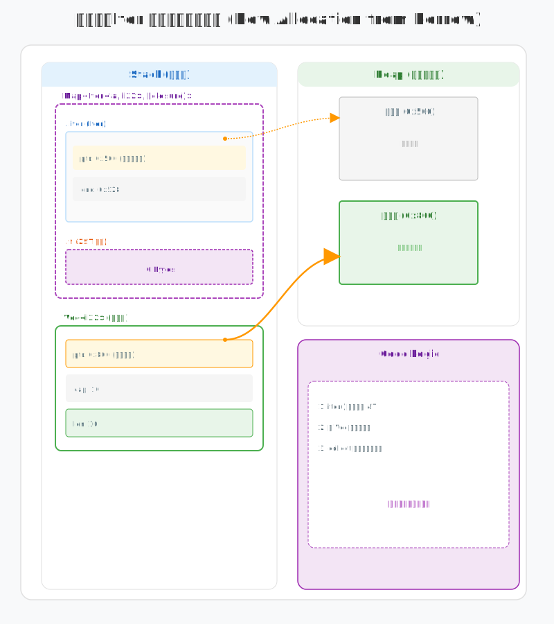

# 从内存视角理解Rust迭代器的collect()

在 Rust 开发中，`collect` 几乎是处理数据的“必经之路”。虽然代码写起来只是简单的一个方法调用，但为了保证性能，标准库在内存底层针对不同场景做了大量优化。

我们可以通过三个典型的内存布局变化，来看看 `collect` 到底是怎么运行的。

## 场景一：从 Range 开始（精准分配）

最简单的场景是从一个范围（Range）创建集合。此时，数据还只是一段逻辑，并没有在堆内存中落地。

```rust
let v: Vec<_> = (0..10).map(|x| x + 1).collect();
```



调用 `collect()` 时，程序首先要解决的问题是：该申请多大的堆内存？

由于 `Range` 结构体只在栈上存储了 `start` 和 `end`，为了避免一边插入一边扩容（那会导致昂贵的内存拷贝），Rust 采取了“先询问、再分配”的策略：
1. **询问长度**：触发迭代器链的 `size_hint()`。在这个例子中，`Range` 能明确告知需要 10 个元素的空间。
2. **一次性申请**：根据拿到的长度一次性申请堆空间，随后将计算结果直接写入。这样就规避了多次扩容带来的性能损耗。

## 场景二：Vec 转换（原地复用）

如果你把一个 `Vec` 通过 `into_iter` 转换成另一个 `Vec`，只要前后数据类型的尺寸 (Size) 和对齐量 (Alignment) 相同，Rust 就能玩出更高级的技巧：内存重用。

```rust
let v1: Vec<i32> = (0..10).collect();
let v2: Vec<i32> = v1.into_iter().map(|x| x + 1).collect();
```



在这段代码里，`v2` 并没有开辟新的堆空间，而是直接“接管”了 `v1` 的地盘：
- **交接指针**：`into_iter()` 把 `v1` 的堆内存指针传给了迭代器。
- **原地覆盖**：`collect` 发现新旧数据的大小一致，就直接在原来的内存地址上写入新值。
- **省去检查**：由于迭代器长度是确定的，编译器甚至可以省掉运行时的边界检查，让数据更新变得极快。

## 场景三：借用数据（必须新分配）

如果数据源只是临时借用的（通过 `iter()`），情况就完全不同了。因为原始数据还要继续存在，我们不能动它的内存。

```rust
let v1: Vec<i32> = (0..10).collect();
let v2: Vec<i32> = v1.iter().map(|x| x + 1).collect();
```



这时候，内存中会清晰地出现两块独立区域：
- **各过各的**：因为 `v1` 依然持有原内存的所有权，`collect` 必须在堆上另找一块地盘来存放 `v2`。
- **物理隔离**：堆内存中会同时存在 `v1` 的原始数据和 `v2` 的计算结果，它们在地址上是完全分开的，互不干扰。

## 总结

Rust迭代器的`collect()` 的高效并非凭空而来，而是源于标准库对内存布局的精细掌控：
- **能预估就预估**：通过 `size_hint` 减少内存申请次数。
- **能重用就重用**：通过 `In-place` 机制消除多余的内存拷贝。
- **该隔离就隔离**：在保证所有权安全的前提下，通过新分配实现数据解耦。

理解了这些底层逻辑，你就能明白 Rust 是如何在保持代码简洁的同时，把每一分硬件性能都用在刀刃上的。
