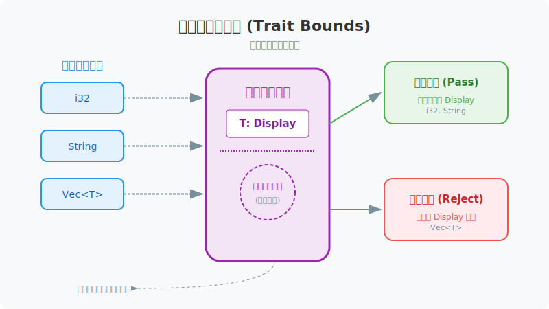
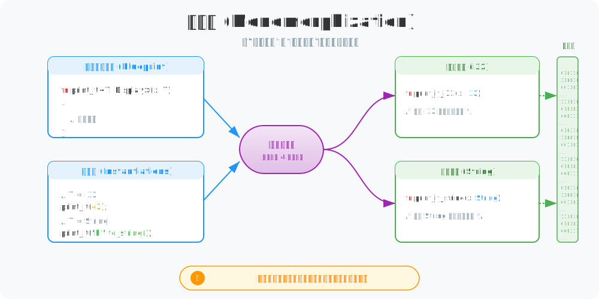
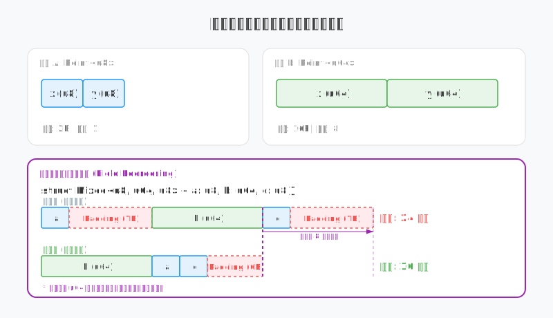
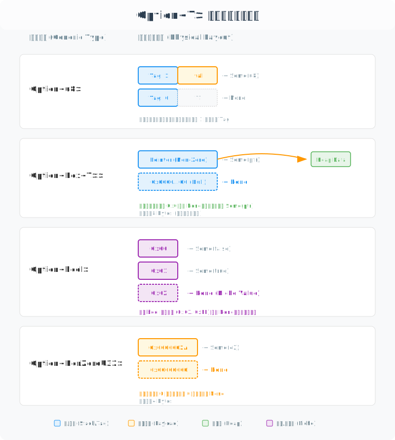
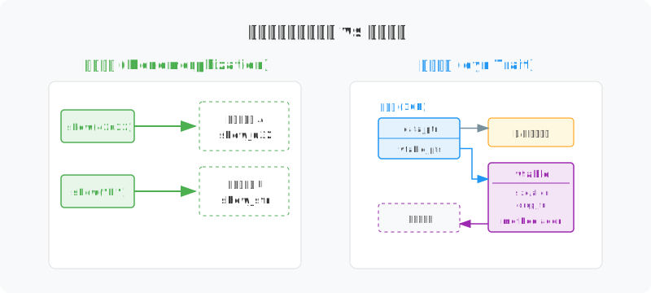

# 图解 Rust 泛型： 编译完就是手写的性能

很多人觉得泛型会让程序变慢，但在 Rust 里恰恰相反。Rust 的泛型在编译完后，其实和你手写的具体类型代码没什么区别。编译器会根据你传入的类型，自动“复印”出几份专属的代码，这就是所谓的“零成本抽象”。

要看懂泛型是怎么工作的，我们得先看看编译器是怎么检查这些类型的。

## 1. 特征约束：给泛型提要求

泛型（Generic）并不是说你可以随便传任何东西。在定义泛型函数时，你通常得告诉编译器：“这个类型必须会做某件事”。这就叫**特征约束（Trait Bounds）**。

```rust
// 只有实现了 Display 的类型 T，才能进入该函数
fn print_it<T: Display>(x: T) {
    println!("{}", x); // 编译器知道 x 肯定有 fmt 方法可以调用
}
```



- **提前把关**：编译器就像个面试官。如果你要求类型必须实现 `Display`，那 `i32` 和 `String` 这种能打印的就过了；但如果你传个 `Vec` 进去，编译器会直接报错，因为它不知道该怎么打印一个列表。
- **心里有底**：有了这些要求，编译器在检查函数内部代码时就很放心。它知道既然你保证了类型 `T` 有 `fmt` 方法，那调用它就是安全的，不用等到运行的时候才去求证。

一旦类型通过了检查，编译器就开始忙活了，它要把抽象的模板变成实实在在的代码。

## 2. 单态化：编译器在帮你写代码

泛型函数其实不是一个“真正的函数”，它更像是一个**模板**。编译器在编译代码时，会看你到底用了哪些类型。这个把模板变成具体代码的过程，专业术语叫“单态化”（Monomorphization）。

```rust
// 泛型模板：不会直接产生机器码
fn print_it<T: Display>(x: T) {
    println!("{}", x);
}

// 编译后的样子：生成的代码和手写的没区别
fn print_it_i32(x: i32) { ... }
fn print_it_string(x: String) { ... }
```



- **自动复印**：编译器会扫描你的代码。比如它看到你调了 `print_it(42)`，它就会自动生成一个 `print_it_i32` 的版本；看到 `print_it("hi")`，就再生成一个 `print_it_string`。
- **快得理所当然**：因为每个版本都是为特定类型定制的，编译器可以像对待普通函数一样，把代码直接“嵌入”（内联）到调用处，或者进行其他优化。这就是为什么 Rust 泛型性能极高的原因——因为它在运行的时候根本没有“泛型”这回事。
- **一点小代价**：这种方式是用空间换时间。你用的类型越多，编译器生成的代码副本就越多，编译出来的程序体积也会随之变大。

既然函数可以复印，那结构体在内存里又是怎么排布的呢？

## 3. 内存布局：像拼积木一样精准

泛型结构体在内存里并不是一个“万能盒子”，而是编译器根据你填进去的类型，实时计算出的结果。Rust 还会聪明地重新排列字段，不让内存被白白浪费。

```rust
// 基础泛型结构体
struct Point<T> {
    x: T,
    y: T,
}

let p1 = Point { x: 1u8, y: 2u8 };    // 占用 2 字节
let p2 = Point { x: 1u64, y: 2u64 };  // 占用 16 字节

// 编译器会自动优化布局
struct Mixed<T, U, V> {
    a: T, // u8
    b: U, // u64
    c: V, // u8
}
```



- **按需定制**：你看 `Point<u8>` 只占 2 个字节，而 `Point<u64>` 则要 16 个字节。编译器会直接把数据平铺在内存里，中间没有任何多余的“零件”。
- **自动省空间（字段重排）**：这是 Rust 的拿手好戏。如果你定义了一个结构体，里面有大有小（比如 `u8` 和 `u64`），编译器会为了减少空隙（Padding）而打乱字段顺序。
    - **优化前**：如果按顺序排，大字段为了对齐，中间会留下很多没用的空位（总共可能占 24 字节）。
    - **优化后**：编译器把大块头放前面，小块头塞在后面或空隙里，让整个结构体变得更紧凑（压缩到 16 字节）。
- **比手写更强**：这种自动优化让你在写通用代码时，物理层面的表现甚至比你自己手动去算对齐、排顺序还要高效。

既然结构体能优化，那包含泛型的枚举（Enum）又是怎么省空间的呢？

## 4. 泛型枚举：抠出每一比特的价值

泛型枚举（比如 `Option<T>`）最能体现 Rust 对内存的“吝啬”。编译器不会傻傻地给每个 `Option` 都额外加个标记位，它会盯着你给出的类型 `T`，看看能不能从它现有的空隙里挤出一点位置来。

这就是**利基优化 (Niche Optimization)**。所谓“利基（Niche）”，就是指某种类型里那些“永远用不到的位”。

```rust
// 1. 普通情况：u8 的 0~255 全都有意义，必须多占 1 字节当标签
let a: Option<u8> = Some(42); 

// 2. 空指针优化：Box/引用保证不为 0，直接拿 0 当 None
let b: Option<Box<u32>> = Some(Box::new(10)); 

// 3. 钻空子：char 有效范围有限，用非法值当 None
let c: Option<char> = Some('A');

// 4. 显式合作：NonZeroU32 明确说 0 没用，编译器就用 0 当 None
let d: Option<std::num::NonZeroU32> = std::num::NonZeroU32::new(100);
```



- **普通情况 (Option<u8>)**：
  因为 `u8` 的 8 位全被占满了，编译器没办法，只能额外加一个字节作为“标签”。所以 `Option<u8>` 占 **2 字节**。
- **空指针优化 (Option<Box<T>>)**：
  这是最常用的招数。在 64 位系统下，`Box` 本身是 8 字节指针，且 Rust 保证它永不为 0。编译器直接把全零位（`0x0`）解释为 `None`。这样 `Option<Box<T>>` 还是只占 **8 字节**。
- **钻空子 (Option<char> / Option<bool>)**：
  `char` 占 4 字节，但很多数值是无效的。编译器会挑一个非法值来当 `None`。`bool` 也是一样，它只用了 0 和 1，剩下 254 个数值都是空位。
- **显式合作 (Option<NonZeroU32>)**：
  通过 `NonZeroU32` 等特殊类型，你显式告诉编译器：这个值永远不会是 0。这给了编译器“钻空子”的底气。

这种细节反映了 Rust 的设计初衷：**类型不仅是为了安全，更是为了让编译器能看透你的数据，从而生成最紧凑的机器码。**

虽然泛型性能极高，但有时候我们直到程序运行起来，才知道要用什么类型，这时候就需要另一种机制。

## 5. 两种分发：提前填空还是现场查表

搞清楚泛型（静态分发）和特征对象（动态分发）的区别，你就能明白 Rust 性能的上限在哪。简单来说，就是看编译器是在“编译时写死代码”还是“运行时现找地址”。

```rust
// 静态分发：为每种具体类型生成专属副本
fn show_static<T: Display>(item: T) {
    println!("{item}");
}

// 动态分发：通过胖指针抹掉具体类型，运行时再看
fn show_dynamic(item: &dyn Display) {
    println!("{item}");
}
```



- **静态分发（泛型）**：
    - **写死代码**：就像前面说的，编译器为每种类型都复印了一份专属代码。
    - **快如闪电**：因为代码是现成的，编译器可以直接把函数调用“拆掉”，直接把逻辑插进去（内联）。这就是 Rust 所谓“零成本抽象”的核心。
- **动态分发（特征对象）**：
    - **胖指针 (Fat Pointer)**：当你用 `&dyn Display` 时，Rust 会用 16 个字节来存它，不仅存了数据地址，还存了一张“虚表”的地址。
    - **查表干活**：每次调用方法，程序都得先去查这张表，看看这个具体的类型到底怎么执行方法。虽然慢了那么一点点，但它胜在灵活，能让你在同一个列表里塞进不同的类型。

## 总结

Rust 的泛型先通过**特征约束**提要求，再通过**单态化**自动复印代码，最后配合**内存布局优化**把数据压实。这种“编译期解决一切”的做法，让你在写高大上的通用代码时，依然能拥有极致的运行效率。
