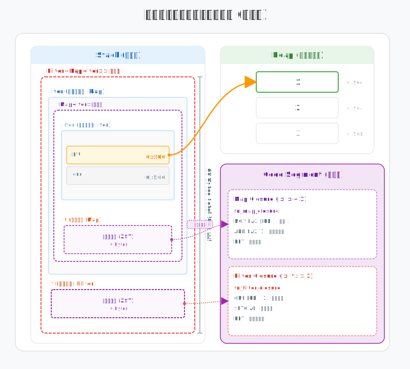
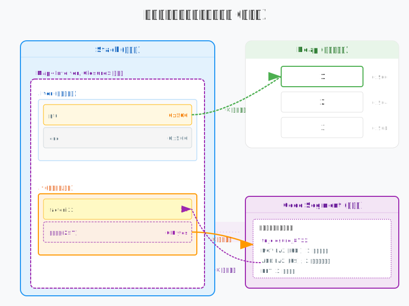

# 从内存视角理解Rust迭代器适配器

在 Rust 中，使用 `.map()`、`.filter()` 等适配器进行链式调用是处理数据的常用方式。这些高层抽象被统称为“零成本抽象”，意味着它们在简化代码逻辑的同时，并不会引入额外的运行开销。

在编译器眼中，这些链式调用并非一系列繁琐的函数跳转，而是一个在栈上精确布局的**嵌套结构体**。这种物理上的嵌套，使得多层抽象在内存中表现得像单个结构体一样紧凑。

本节我们将深入内存底层，拆解这些适配器的物理布局，看它们是如何在保持逻辑清晰的同时，实现与底层代码相当的执行效率。

## 不捕获变量时，嵌套的适配器在栈内存中如何布局？

当我们连续调用多个适配器时，编译器会将它们递归地包装成嵌套的类型。如果闭包不捕获任何外部变量，这种链式结构在物理内存中是如何组织的？

```rust
let iter = vec![1, 2, 3]
    .into_iter()
    .map(|x| x + 1)      // 逻辑闭包，不捕获变量
    .filter(|x| *x > 2); // 逻辑闭包，不捕获变量
```



在栈内存中，这种嵌套关系遵循着明确的物理规则。最显著的特征是**首字节对齐**：外层适配器结构体的起始地址与其内部包裹的字段在内存中是完全重合的。这意味着在机器码层面，对 `Filter` 的引用可以直接等同于对内部 `Map` 甚至最底层基础迭代器的引用。编译器在处理这种嵌套时，不需要进行额外的地址偏移计算，从而从物理上消除了多层抽象带来的寻址开销。

同时，由于上述代码中的闭包没有捕获任何外部变量，它们在 Rust 中被实现为**零大小类型（ZST）**。这意味着在运行时，这些闭包不占据任何栈空间。如上图所示：
- **栈空间**：整个 `Filter<Map<Iter>>` 结构体的大小完全由最底层的 `Iter`（持有指针和边界信息）决定。
- **逻辑分层**：闭包的执行逻辑被单态化到**代码区**，通过静态绑定与适配器关联。由于没有捕获变量，这些指令可以直接对寄存器中的数据进行操作，无需进行任何内存寻址来获取环境。

## 捕获变量时，数据环境与执行逻辑如何协作？

在实际开发中，闭包往往需要访问外部定义的变量。此时，适配器不仅要管理迭代状态，还要负责保存这些被捕获的数据。在内存底层，Rust 会将这种需求拆解为状态、数据环境与执行逻辑三个部分，并让它们在不同的内存区域中各司其职。

```rust
let factor = 10;
let iter = vec![1, 2, 3]
    .into_iter()
    .map(|x| x + factor); // 闭包捕获外部变量 factor
```



从内存结构上看，一个包含捕获变量的适配器（如 `Map`）会将相关信息分布在不同的区域：

1. **数据指针（栈）**：迭代器本身持有的状态（如指向集合起始位置的指针），存储在**栈**上。
2. **捕获的变量（栈）**：闭包所依赖的外部数据（如 `factor`）会成为适配器结构体的成员，同样存储在**栈**上。此时闭包不再是零大小类型，而是占据实际的内存空间。
3. **计算逻辑（代码区）**：闭包的具体运算代码在编译时就已生成并固定在**代码区**。

当你调用 `iter.next()` 时，CPU 会按照以下逻辑执行：

- **取值**：根据栈上的指针，从内存中读取原始数据。
- **跳转**：直接跳转到代码区执行预先编译好的闭包指令。
- **运算**：指令运行过程中，会通过栈地址的偏移量找到捕获的变量，在寄存器中快速完成计算。

这种设计实现了**数据与指令的解耦**。适配器在栈上开辟了一块连续空间，把迭代状态和闭包环境紧凑地打包在一起。由于所有数据的内存偏移量在编译期就已确定，运行时不需要任何间接寻址或动态查找，这正是 Rust 迭代器能够实现零成本抽象的底层原因。

## 总结

总的来说，Rust 迭代器适配器的“零成本”并不是什么魔法，而是编译器在幕后做了大量细致的工作。当你把多个适配器链接在一起时，编译器并没有生成一串复杂的函数调用，而是把它们打包成了一个简单的、嵌套的结构体放在栈上。

这种设计的好处在于，所有的计算逻辑和变量位置在编译时就已经固定好了。程序运行过程中，只需要根据预先算好的内存偏移量去处理数据，不需要进行额外的查找或动态跳转。这种将高层语法直接对应到简单内存布局的做法，让我们可以放心地使用各种抽象，而不必担心性能损失。
