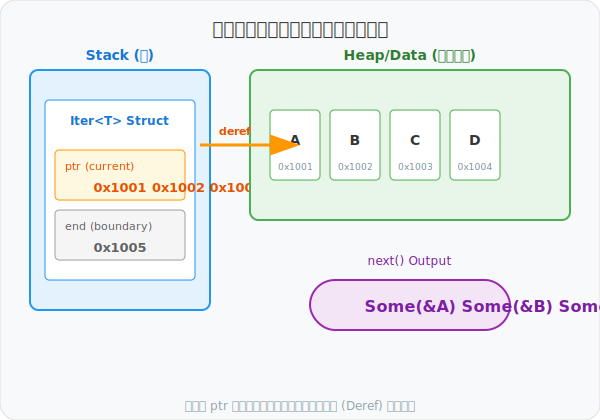
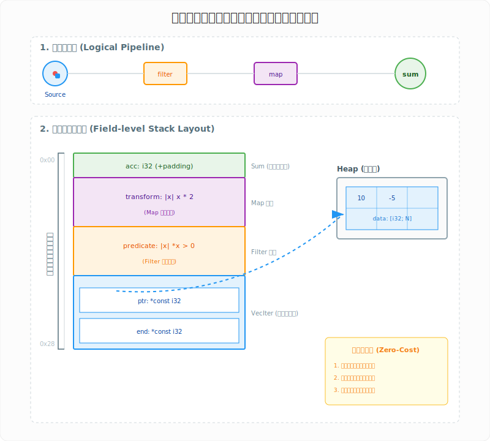

# 图解 Rust：迭代器 (Iterator) —— 零成本抽象的演进

在 Rust 的性能哲学中，迭代器并非简单的语法糖，而是基于**有限状态机 (Finite State Machine)** 构建的零成本抽象。它通过**惰性求值 (Lazy Evaluation)** 与**循环展开/融合 (Loop Fusion)**，在提供高阶抽象的同时，实现了等同甚至超越手写汇编的执行效率。

## 1. 内存安全边界：索引 vs 抽象

手动索引访问不仅增加了**越界 (Out-of-Bounds, OOB)** 的运行时风险，更由于编译器难以预判索引逻辑，往往无法消除冗余的边界检查。迭代器通过封装底层指针逻辑，将内存安全性从开发者肩上转移到了编译器手中。

<div align="center">
  
</div>

- **索引模式 (Index-based)**：依赖运行时谓词 `i < len`，易诱发 OOB 崩溃或产生非必要的边界检查开销。
- **迭代器模式 (Iterator-based)**：通过内部指针迭代，编译器可根据其确定性边界进行 **BCE (Boundary Check Elimination)** 优化。

## 2. 核心原语：有限状态机的转移逻辑

迭代器在内存布局上通常是一个轻量级的结构体，本质上是维护当前偏移量的**状态机**。

<div align="center">
  
</div>

- **状态演进**：每次调用 `next()` 都会触发状态转移，返回 `Option<Item>`。
- **所有权三剑客**：根据对底层数据的持有方式，迭代器分为三种核心模式：
  - `iter()`：借用模式，返回 `&T`（不可变引用）。
  - `iter_mut()`：修改模式，返回 `&mut T`（可变引用）。
  - `into_iter()`：消耗模式，返回 `T`（转移所有权）。

## 3. 零成本抽象：逻辑流水线与物理内存的深度统一

Rust 迭代器的核心魅力在于它实现了**声明式编程 (What to do)** 与**指令级执行效率 (How to do)** 的完美融合。通过编译期的类型推导与优化，复杂的链式调用最终会转化为紧凑的机器码。

### 3.1 逻辑层：拉取式动力模型 (Pull-based Pipeline)
迭代器链条在逻辑上可以看作是一条“自动感应”的流水线，由两类角色协同工作：
- **动力源：消费者 (Consumers)**：如 `sum`, `collect`。它们是流水线的“抽水泵”，通过不断调用 `next()` 产生向前的吸力。只有当消费者开始工作时，整个链条才会被激活。
- **装饰器：适配器 (Adapters)**：如 `filter`, `map`。它们是惰性的逻辑容器，并不持有或处理数据，仅负责在数据经过时应用转换逻辑。

### 3.2 物理层：字段级的“洋葱”嵌套布局
在内存中，链式调用并非通过指针链接的对象，而是被编译器“压扁”成了一个深度嵌套的**单体结构体 (Flat Layout)**：
- **零成本封装**：所有的适配器（如 `Filter`）和它们持有的闭包（如 `predicate`）都以字段形式直接存储在栈上。这意味着迭代器链的深度增加，只会增加栈空间的微小占用，而**完全不涉及堆分配**。
- **循环融合 (Loop Fusion)**：由于编译器在编译期就能看透这种嵌套的类型结构，它可以将多级处理逻辑合并为单一的紧凑循环。这消除了中间结果的存储开销，并赋予了 CPU 极高的分支预测效率。

<div align="center">
  
</div>

- **静态分发 (Static Dispatch)**：图中展示的 `transform` 和 `predicate` 闭包被编译为具体的匿名类型。编译器据此进行**内联 (Inlining)** 优化，消除了虚函数调用的开销。
- **指针直连**：最核心的 `VecIter` 字段直接持有指向堆内存的原始指针。这种“直连”设计确保了从最外层 `sum` 到最内层数据的访问路径最短。

## 4. 工程实践：意图驱动编程

在生产环境中，优先选择声明式迭代器而非命令式循环，不仅是为了代码的可读性，更是为了赋予编译器更深层的优化空间。

```rust
// 推荐实践：声明式链式调用，赋予编译器 BCE 优化空间
let filtered_sum: i32 = data
    .iter()                // 获取不可变引用迭代器
    .filter(|&&x| x >= 0)  // 谓词过滤：仅保留非负数
    .map(|&x| x.pow(2))    // 映射：计算平方
    .sum();                // 消费：归约求和
```

> **性能贴士：避免非必要的 collect()**
> 
> 在迭代器链条中，每次调用 `.collect::<Vec<_>>()` 都会触发堆内存分配并破坏流水线的“循环融合”优化。除非你需要将中间结果存储下来或多次复用，否则应尽可能保持链条的“惰性”，直到最后的消费者算子（如 `sum`, `for_each`, `fold`）。

> **架构启示**：迭代器是 Rust “显式意图，隐式优化”的核心体现。当你编写 `iter().map().collect()` 时，你是在构建一张逻辑图，而 Rust 编译器则是负责将这张图转化为极致指令流的炼金术士。
