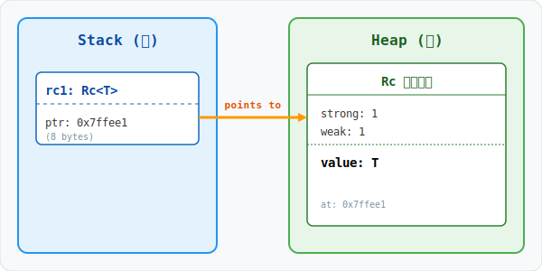
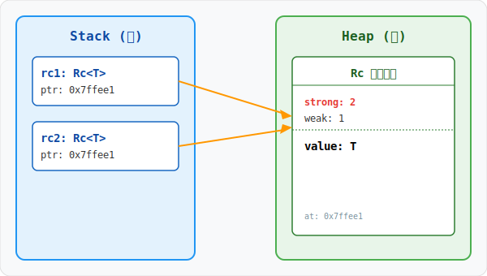
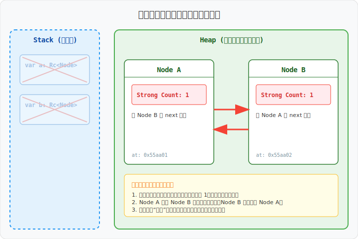

# Rc<T>：引用计数与共享所有权

在 Rust 的严苛所有权法则下，一个值通常只有一个所有者。然而，现实开发中（如图形结构、多路搜索树或 UI 框架）经常需要**共享所有权**。`Rc<T>`（Reference Counted）正是为此而生。

## 1. 什么是 Rc<T>？

`Rc<T>` 是一个只读的、具有引用计数的智能指针。它允许你在堆上分配内存，并让多个变量共同拥有这块内存的所有权。只有当最后一个所有者销毁时，堆上的内存才会被释放。

> **核心原则**：`Rc<T>` 仅适用于**单线程**场景。如果需要跨线程共享，请使用 `Arc<T>`。

## 2. 内存布局剖析

当你创建一个 `Rc::new(data)` 时，Rust 会在堆上分配一个特殊的结构体 `RcBox<T>`。



- **栈上（Stack）**：`Rc<T>` 本身是一个指针，指向堆上的 `RcBox`。
- **堆上（Heap）**：`RcBox` 包含三个部分：
    1. **Strong Count**：强引用计数。决定了值的生命周期。
    2. **Weak Count**：弱引用计数。辅助处理循环引用（本文暂不深入探讨）。
    3. **Value**：实际存储的数据 `T`。

## 3. 共享所有权：引用计数的变化

使用 `Rc::clone(&rc)` 不会深拷贝堆上的数据，而只是在栈上创建一个新的指针，并增加堆上的强引用计数。

> **地道写法提示**：在 Rust 中，我们倾向于写 `Rc::clone(&rc)` 而不是 `rc.clone()`。虽然两者效果相同，但前者能一眼看出这只是一个增加计数的“廉价”克隆，而不是昂贵的数据深拷贝。



```rust
use std::rc::Rc;

fn main() {
    let rc1 = Rc::new(String::from("Shared Data"));
    println!("Count after rc1: {}", Rc::strong_count(&rc1)); // 1

    {
        // 显式调用 Rc::clone，语义更清晰
        let rc2 = Rc::clone(&rc1); 
        println!("Count after rc2: {}", Rc::strong_count(&rc1)); // 2
    } // rc2 离开作用域，计数减 1

    println!("Count after rc2 dropped: {}", Rc::strong_count(&rc1)); // 1
}
```

## 4. 局限性：Rc<T> 的不可变约束

`Rc<T>` 赋予了你“共享”的能力，但它通过 `Deref` 提供的引用是**只读**的。这是为了防止多个所有者同时修改数据导致的数据竞争（即使在单线程下，多处可变借用也是不安全的）。

如果你需要修改 `Rc` 内部的数据，通常需要配合 **内部可变性（Interior Mutability）** 模式，这超出了本文的讨论范围。

## 5. 致命陷阱：循环引用 (Reference Cycles)

虽然 `Rc` 能自动管理内存，但它无法处理循环引用。如果两个 `Rc` 互相指向对方，它们的引用计数将永远不会归零，导致内存泄漏。



## 6. 避坑指南

1. **不要在多线程中使用**：`Rc<T>` 没有实现 `Send` 和 `Sync` trait。在多线程环境下，引用计数的加减操作不是原子的，会导致计数错误。
2. **克隆 vs 拷贝**：虽然 `Rc::clone` 很轻量，但它依然涉及堆内存访问和计数操作。如果只是在局部函数中使用，直接传递 `&T` 通常更高效。

## 7. 最佳实践

> **只有在“无法确定谁是最终所有者”或“数据确实需要被多个不相关的结构共享”时，才使用 `Rc<T>`。** 
