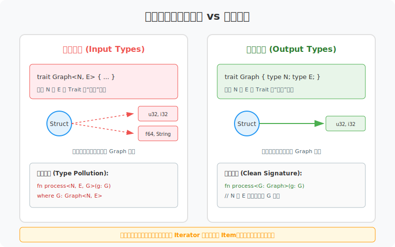
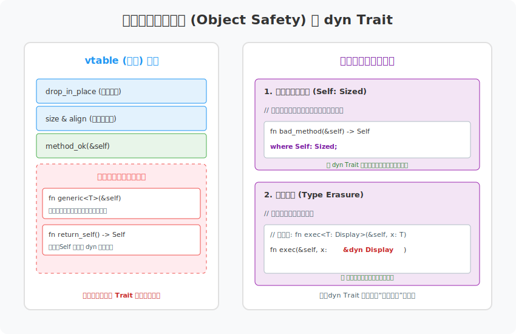
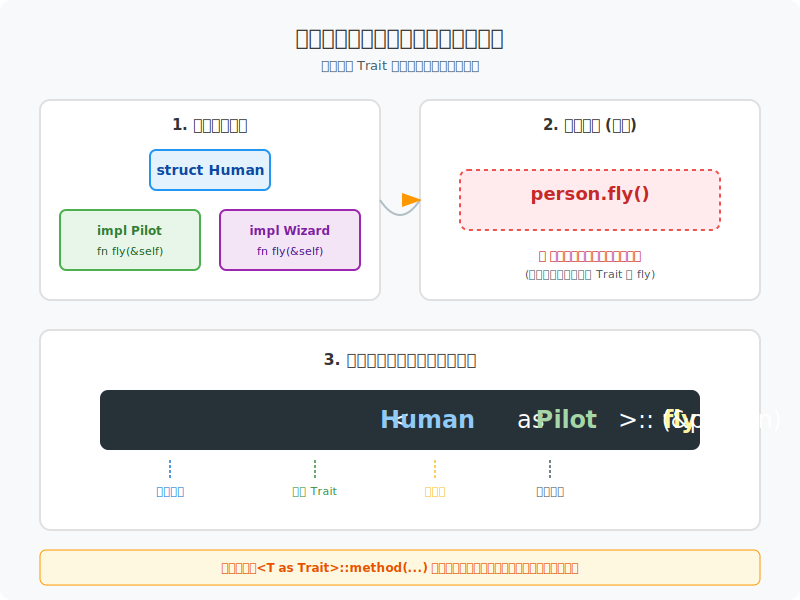
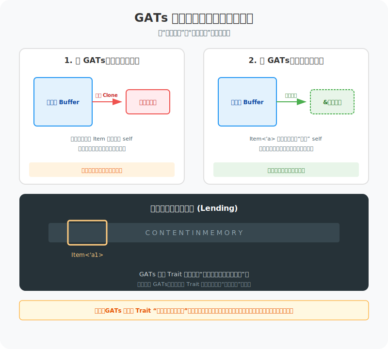

# 图解 Rust：特型 (Trait) 进阶 —— 深度抽象与类型魔法

在掌握了特型的基础分发机制后，我们需要深入 Rust 类型系统的“深水区”。进阶特型不仅关乎代码的复用，更关乎如何构建高度抽象且类型安全的架构。

## 1. 关联类型 (Associated Types)：封装的艺术

为什么 `Iterator` 特型使用 `type Item` 而不是 `Iterator<T>`？



- **类型爆炸 vs 唯一性**：泛型允许为一个类型实现多次同一个特型（如 `impl Trait<u32>` 和 `impl Trait<f32>`），而关联类型强制一个类型只能有一个特定的实现。
- **易用性**：关联类型将类型参数封装在特型内部，避免了在函数签名中携带大量冗余的泛型参数。

## 2. 对象安全性 (Object Safety)：为什么有些 Trait 不能 dyn？

简单来说，**对象安全性**就是编译器在问：“我能不能为这个 Trait 制作一张**固定大小**的函数查询表 (vtable)？”

如果一个 Trait 满足对象安全性，你就能把它写成 `dyn Trait`（特型对象）。如果不满足，编译器就无法在运行时通过指针找到正确的方法。



### 为什么会有这些限制？

*   **限制一：不能有泛型方法**
    *   **冲突点**：泛型方法在编译时会根据不同的参数类型生成无数个副本（单态化）。
    *   **逻辑**：虚表 (vtable) 的大小必须在编译时确定。我们无法在一个固定大小的表里，为“无数个”可能的泛型副本预留位置。
*   **限制二：方法不能返回 `Self` (按值返回)**
    *   **冲突点**：`dyn Trait` 的核心是“类型擦除”，即运行时我们只知道它实现了某个 Trait，但不知道它的具体大小。
    *   **逻辑**：如果方法返回 `Self`，调用者需要在栈上预留空间。既然不知道具体类型，就不知道该预留 8 字节还是 800 字节，导致程序无法运行。

### 救急方案：`where Self: Sized`
如果你必须在 Trait 里写一个不安全的方法，但又想让这个 Trait 支持 `dyn`，你可以给那个方法加上 `where Self: Sized`。这相当于告诉编译器：“这个方法只给那些大小确定的具体类型用，`dyn Trait` 这种大小不确定的类型就别管它了。”

## 3. 完全限定语法 (Fully Qualified Syntax)：消除歧义

当一个类型实现了多个拥有同名方法的特型时，Rust 需要你指明具体的“身份”。



```rust
trait Pilot { fn fly(&self); }
trait Wizard { fn fly(&self); }
struct Human;

impl Pilot for Human { fn fly(&self) { println!("准备起飞"); } }
impl Wizard for Human { fn fly(&self) { println!("施展飞行咒"); } }

fn main() {
    let person = Human;
    // 使用完全限定语法
    <Human as Pilot>::fly(&person);
    <Human as Wizard>::fly(&person);
}
```

## 4. 覆盖实现 (Blanket Implementations)：类型系统的“横向扩展”

Rust 标准库中最强大的模式之一：为所有实现了 `TraitA` 的类型自动实现 `TraitB`。

```rust
// 示例：标准库为所有实现 Display 的类型实现 ToString
impl<T: Display> ToString for T {
    // ...
}
```

- **威力**：这允许我们通过简单的约束，为庞大的类型族群一次性注入功能。

## 5. 泛型关联类型 (GATs)：从“搬运工”到“窗口观察员”

很多同学看了 GATs 的语法后会问：**“这到底有什么用？”** 

简单来说，GATs 解决了 Rust 类型系统中的一个深度矛盾：**如何在 Trait 的抽象层面上，让产出的数据“借用”容器本身？**



### 局限：所有权的“昂贵搬运”

在没有 GATs 之前，如果你定义一个 Trait 来读取大型 Buffer，你往往只能被迫返回**所有权**（即 Clone 数据）：

```rust
trait MyReader {
    type Item; 
    fn read_next(&mut self) -> Self::Item;
}

struct LargeBuffer {
    data: String,
}

impl MyReader for LargeBuffer {
    type Item = String; // 必须返回 String（所有权）
    fn read_next(&mut self) -> String {
        self.data[..100].to_string() // ❌ 必须 Clone，因为 Item 无法借用 self
    }
}
```
**后果**：每读一次数据都要发生一次内存分配和拷贝，性能在处理海量数据时会崩溃。

### 突破：GATs 的“零拷贝窗口”

有了 GATs，我们可以定义一个**能接收生命周期的关联类型**。这就像是给 Trait 装上了一个“滑动窗口”：

```rust
trait MyReader {
    // 1. 允许 Item 携带一个生命周期参数 'a
    type Item<'a> where Self: 'a;

    // 2. 产出的 Item 直接借用 self 的生命周期
    fn read_next<'a>(&'a mut self) -> Self::Item<'a>;
}

impl MyReader for LargeBuffer {
    type Item<'a> = &'a str; // ✅ 现在可以直接返回引用了！
    fn read_next<'a>(&'a mut self) -> &'a str {
        &self.data[..100] // 🚀 零拷贝，直接观察内部内存
    }
}
```

- **核心价值**：GATs 允许我们在 Trait 层面定义一种“随调用动态生成的借用关系”。
- **实战意义**：这是构建**高性能异步运行时**、**零拷贝解析器**（如数据库驱动、协议解析）以及**高级数学库**的基石。没有它，这些库的抽象要么性能低下，要么语法极其臃肿。

## 一句话总结

**进阶特型是 Rust 类型系统的“杠杆”：关联类型简化了表达，对象安全性界定了动态边界，覆盖实现提供了横向扩展，而 GATs 则让零拷贝抽象成为了可能。**
